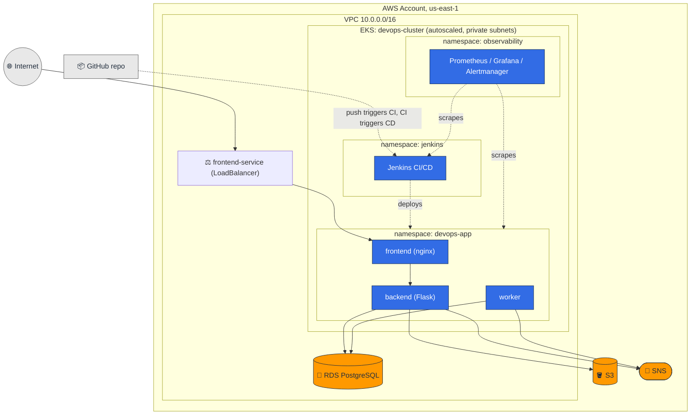
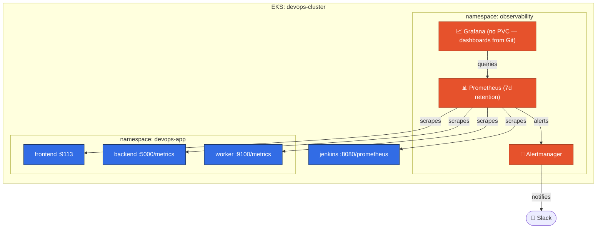

# DevOps on AWS — Jenkins CI/CD & Observability on Kubernetes

Self-hosted **Jenkins** on **EKS** building and deploying a 3-tier app (nginx frontend, Flask
backend, a background worker) through two pipelines — a push-triggered **CI** pipeline that builds,
tests, scans, signs, and pushes immutable-tagged images, and a **CD** pipeline that deploys via
`helm upgrade --install`, verifies the rollout, and smoke-tests the result. A **Prometheus +
Grafana + Alertmanager** stack instruments the app and Jenkins itself, alerts to Slack on real
failure conditions, and gates every CD deploy on the release's actual live health, not just
`Running`.

Built solo, not in a pair.

## Contents

- [Architecture](#architecture)
- [Prerequisites](#prerequisites)
- [Installation](#installation)
- [Configuration & Secrets](#configuration--secrets)
- [CI/CD Pipelines](#cicd-pipelines)
- [Observability](#observability)
- [Security](#security)
- [Troubleshooting](#troubleshooting)
- [Teardown](#teardown)
- [Design Decisions](#design-decisions)
- [Repository Layout](#repository-layout)
- [History](#history)

---

## Architecture

Jenkins runs in the same `devops-cluster` EKS cluster as the app, in its own `jenkins` namespace —
separate RBAC and ServiceAccounts from `devops-app` give the isolation that matters without the
cost and cross-cluster credentials a second cluster would need.



**Security boundary**: Jenkins has no public IP, Ingress, or LoadBalancer — it's `ClusterIP` only,
reachable via `kubectl port-forward`. Inbound webhooks never reach it directly either: GitHub POSTs
to a public [smee.io](https://smee.io) relay channel, and an in-cluster `webhook-relay` Deployment
holds an *outbound* connection to that channel and forwards matching events to Jenkins internally.
Zero inbound ports open to the internet, in either direction.

**Components**:

| Component | Role |
|---|---|
| `jenkins/` | Jenkins install/config scripts, CI + CD + PR Jenkinsfiles, JCasC values, RBAC, job configs |
| `observability/` | Prometheus/Grafana/Alertmanager values, alert rules, dashboards, runbooks |
| `helm/devops-app/` | The app's Helm chart, deployed by Jenkins CD |
| `terraform/` | RDS, S3, SNS, ECR, IAM, VPC — no compute |
| `frontend/` `backend/` `worker/` | The 3-tier application itself |
| `evidence/` | Captured proof for the assignment checklist (live command/API output) |

Full component-level detail (JCasC, per-service instrumentation, NetworkPolicy internals) lives in
the linked docs throughout this README rather than duplicated here.

---

## Prerequisites

| Tool | Version | Where pinned |
|---|---|---|
| EKS cluster | Kubernetes 1.34 | `setup.sh` |
| Jenkins controller image | `jenkins/jenkins:2.541.3-lts-jdk17` | `jenkins/values.yaml` |
| Jenkins Helm chart | `5.9.54` (jenkinsci/jenkins) | `jenkins/scripts/install-jenkins.sh` |
| eksctl | `v0.229.0`/`0.230.0` | `setup.sh` |
| Helm (client) | `v3.21.4` | any recent 3.x |
| kubectl / aws-cli | any recent version | client-side |
| Cosign | `v3.1.3` (fetched + checksum-verified at CI runtime) | `jenkins/ci/Jenkinsfile` |
| crane | `v0.21.9` (same fetch pattern) | `jenkins/ci/Jenkinsfile` |
| Cluster Autoscaler chart | `9.59.0` (app `1.35.0`) | `jenkins/scripts/install-jenkins.sh` |
| kube-prometheus-stack chart | `88.5.4` | `observability/scripts/install-observability.sh` |
| promtool / kubeconform | `v3.14.0` / `v0.8.0` (checksum-verified) | `jenkins/ci/Jenkinsfile` |
| nginx-prometheus-exporter | `1.5.3` (digest-pinned) | `helm/devops-app/values.yaml` |

Also required: a GitHub repository with permission to add a webhook.

---

## Installation

Everything is scripted and idempotent — safe to re-run. Run in this order:

**1. Infrastructure** (Terraform + EKS cluster + the app's base images):

```bash
bash setup.sh
```

Provisions RDS/S3/SNS/ECR/IAM/VPC via Terraform, creates the EKS cluster inside that VPC, enables
NetworkPolicy enforcement, sets up IRSA, External Secrets Operator, cert-manager, Fluent Bit, and
builds/pushes the three app images. Takes ~20-30 minutes on a first run. It does **not** deploy the
app — that's Jenkins CD's job, triggered once the pipeline exists below.

**2. Jenkins**:

```bash
bash jenkins/scripts/install-jenkins.sh       # namespace, RBAC, Jenkins Helm release + JCasC, Cluster Autoscaler
bash jenkins/scripts/configure-jenkins.sh     # smee.io relay, webhook, PR-token secret
kubectl port-forward svc/jenkins -n jenkins 8080:8080 &
bash jenkins/jobs/create-jobs.sh              # creates ci-application / cd-application / ci-application-pr via REST API
bash jenkins/scripts/verify-jenkins.sh        # read-only health check
```

Nothing here is done through the Jenkins UI — JCasC (`jenkins/values.yaml`) drives the plugin list,
Kubernetes cloud, and agent templates; jobs come from the `config.xml` files in `jenkins/jobs/`.

A push to `main` now triggers CI, which on success triggers CD automatically.

**3. Observability** (after Jenkins is up):

```bash
bash observability/scripts/install-observability.sh
bash observability/scripts/verify-observability.sh
```

Installs kube-prometheus-stack, alert/recording rules, dashboards (as ConfigMaps, never a manual
Grafana import), and NetworkPolicies. Must run after `install-jenkins.sh` — both charts declare
`ServiceMonitor` resources that need this stack's CRDs to exist first.

**Windows note**: running these from Git Bash needs `MSYS_NO_PATHCONV=1` on any `kubectl exec`
call with a Unix path argument (already set inside the scripts that need it) — otherwise MSYS
rewrites the path before it reaches the container. No-op on Linux/Mac.

**Access once installed**:

```bash
kubectl port-forward svc/jenkins -n jenkins 8080:8080 &
kubectl port-forward svc/kube-prometheus-stack-grafana -n observability 3000:80 &
kubectl get pods,deployments,services -n devops-app
```

Open the LoadBalancer URL `setup.sh` prints (self-signed HTTPS — the browser warning is expected).

---

## Configuration & Secrets

| Secret | Source |
|---|---|
| ECR push (CI) | IRSA (`ci-build-sa`) — no static credential |
| kubectl/helm access (CD) | `cd-deploy-sa`'s own ServiceAccount token, auto-mounted |
| DB password | AWS Secrets Manager, synced by External Secrets Operator — never touches Jenkins |
| GitHub webhook signature | `git-webhook-secret` K8s Secret, generated by `configure-jenkins.sh` (`openssl rand -hex 20`) |
| PR webhook routing token | Same Secret's `pr-token` key |
| Slack webhook URL (bonus) | `slack-webhook-url` Secret, from `$SLACK_WEBHOOK_URL` if set — optional |
| Grafana admin password | Generated at install time by `install-observability.sh`, printed once |

No secret is ever committed. `jenkins/secrets/credentials.example.yaml` documents the shape of
each without real values. To rotate a credential: delete its Secret, re-run the script that
creates it, update the corresponding external config (e.g. GitHub's webhook secret) to match — no
Jenkins restart needed.

---

## CI/CD Pipelines

**CI** (`jenkins/ci/Jenkinsfile`, triggered on push):

| Stage | What it does |
|---|---|
| Checkout | Pulls the repo, computes `IMAGE_TAG` = full commit SHA |
| Validation | Confirms Dockerfiles and the Helm chart exist |
| Lint / Tests | `pyflakes` + `pytest`, JUnit results published |
| Build, Scan, Push+Sign (matrix) | One Pod per service: Kaniko builds to a local tarball, Trivy scans it and generates an SBOM (blocking on fixable CRITICAL findings), `crane` pushes the already-scanned tarball, Cosign signs the pushed digest via AWS KMS |
| Observability Validation | Dashboard JSON syntax, `promtool check rules`, `kubeconform` schema check on ServiceMonitors/rules |

Images are tagged with the immutable commit SHA (never `latest`); ECR repos are
`IMAGE_TAG_MUTABILITY: IMMUTABLE`. On success, CI triggers CD with `IMAGE_TAG` and a
`release-manifest.txt` (build number, commit, all three image digests) for full traceability.

A separate **PR quality gate** (`jenkins/ci/pr-Jenkinsfile`) runs Lint/Tests/Build/Scan on every PR
via a `generic-webhook-trigger`-based job, with HMAC signature verification in the relay — nothing
it builds ever reaches ECR.

**CD** (`jenkins/cd/Jenkinsfile`, triggered by CI):

| Stage | What it does |
|---|---|
| Input Validation | Rejects a missing/`latest` `IMAGE_TAG` or malformed manifest digests |
| Deploy | `helm upgrade --install devops-app ./helm/devops-app --set image.tag=$IMAGE_TAG --wait` |
| Rollout / Verify | `kubectl rollout status`; confirms every Pod runs the deployed tag |
| Smoke Test | Real HTTP request to `frontend-service`, retried while endpoints propagate |
| Monitoring Gate | Polls Prometheus until `up==1` for all services, generates real traffic, checks the live error rate before accepting the release |

A deploy failure at any stage after Deploy triggers an automated `helm rollback` in
`post{failure{}}`, gated on the cluster's actual Helm revision state rather than a success-only
flag (so a `--wait` timeout that already created a revision server-side is still caught).

---

## Observability



Built on `kube-prometheus-stack` (Prometheus Operator, Prometheus, Alertmanager, Grafana,
kube-state-metrics, node-exporter) rather than a hand-rolled stack, using the standard
`ServiceMonitor`/`PodMonitor`/`PrometheusRule` CRDs for discovery.

**Alerts** (`observability/rules/*.yaml`), each with a `runbook_url` pointing at
`observability/runbooks/`:

| Alert | Condition | `for` | Severity |
|---|---|---|---|
| `HighErrorRate` | Backend 5xx rate > 5% | 2m | critical |
| `HighLatencyP95` | Backend p95 request duration > 1s | 5m | warning |
| `ReplicasMismatch` | Available replicas != desired | 5m | warning |
| `NodeNotReady` | Node `Ready` false/unknown, or under pressure | 5m | critical |
| `JenkinsQueueStuck` | Jenkins build queue non-empty | 5m | warning |
| `PrometheusTargetDown` | Any scrape target `up == 0` | 5m | critical |

**Dashboards** (`observability/dashboards/*.json`), loaded from Git via Grafana's
sidecar-ConfigMap mechanism — reinstalling the release reproduces every dashboard from code alone:
**Application Overview** (request rate/errors/latency, business metrics, filterable by
`$version`/`$pod`), **Kubernetes Cluster** (node/pod health, restarts, OOM kills), **Jenkins
Delivery** (queue size, build results, deployment health).

Application instrumentation: `backend/app.py` and `worker/worker.py` use `prometheus_client`
directly (manual hooks, not an auto-instrumentation library, for control over label cardinality);
the frontend gets an `nginx-prometheus-exporter` sidecar scraping nginx's own `stub_status`.

---

## Security

- **No `cluster-admin` anywhere.** Every ServiceAccount (`jenkins-controller`, `cd-deploy-sa`,
  `ci-build-sa`, `backend-sa`, `worker-sa`, etc.) is scoped to exactly the resources and namespace
  it needs.
- **No static AWS credentials.** IRSA everywhere — CI pushes to ECR and signs via KMS through a
  real IAM role; the backend/worker read RDS/S3/SNS the same way.
- **No Docker socket.** CI builds with Kaniko (daemonless); CD uses a prebuilt `kubectl`+`helm`
  image. Every container runs `runAsNonRoot`, no privilege escalation, dropped capabilities,
  read-only root filesystem (except Kaniko, which needs `chown`/`chmod` to unpack image layers).
- **NetworkPolicies**: default-deny baseline in every namespace (`jenkins`, `devops-app`,
  `observability`) with explicit scoped allows. Enforced, not just defined — EKS ships VPC CNI
  policy enforcement disabled by default; `setup.sh` turns it on explicitly. One documented
  limitation: plain L3/L4 NetworkPolicy can't scope internet-bound HTTPS by destination (GitHub,
  ECR, KMS, Slack) or hostNetwork traffic (node-exporter, kubelet) — those rules are scoped as
  tightly as possible but are a statement of intent, not a hard enforcement boundary.
- **Images pinned by digest**, scanned with Trivy (blocking on fixable CRITICAL findings for the
  app images CI builds; third-party base images scanned once, results in `evidence/`).
- **No secrets in Git.** See [Configuration & Secrets](#configuration--secrets).
- **No PII, no unbounded cardinality.** Metric labels use templated route paths, never raw URLs or
  user/request IDs.

---

## Troubleshooting

Start with the read-only health checks — each one reports Pods, PVCs, releases, and live target
status in a single pass:

```bash
bash jenkins/scripts/verify-jenkins.sh
bash observability/scripts/verify-observability.sh
```

| Symptom | Check |
|---|---|
| Build never queues / stuck agent | `kubectl get pods -n jenkins`, `kubectl describe pod <ci-agent-pod> -n jenkins` |
| Webhook not triggering a build | `configure-jenkins.sh`'s smee.io channel is up; `kubectl logs deploy/webhook-relay -n jenkins` |
| CD rollback fired | Check the build console log — `post{failure{}}` prints exactly which stage failed and whether a rollback ran |
| A ServiceMonitor/PodMonitor apply fails with `no matches for kind ServiceMonitor` | Install order — `observability` must exist before `helm upgrade` on a chart that declares one |
| Alert not reaching Slack | `kubectl get secret slack-webhook-url -n observability`; Alertmanager's root route must point at the `slack` receiver (`observability/values.yaml`) |
| Any firing alert | Its `runbook_url` annotation links straight to `observability/runbooks/<Alert>.md` — check-first commands, likely causes, resolution steps |
| Windows: `kubectl exec` path errors | Set `MSYS_NO_PATHCONV=1` (Git Bash rewrites Unix paths otherwise) |

For deeper NetworkPolicy/RBAC/pipeline-design context, see [Security](#security) and
[Design Decisions](#design-decisions).

---

## Teardown

```bash
bash jenkins/scripts/uninstall-jenkins.sh           # removes Jenkins, its PVC, RBAC, webhook relay
bash observability/scripts/uninstall-observability.sh  # removes the observability release, PVC, NetworkPolicies
bash teardown.sh                                    # everything else: cluster, RDS, all AWS infra
bash verify-teardown.sh                             # read-only check that nothing billable was left behind
```

Or via `make`:

```bash
make k8s-deploy       # setup.sh — infra bring-up only
make k8s-teardown      # teardown.sh — removes everything
make verify-teardown   # verify-teardown.sh
```

`teardown.sh` tears down in an order that matters (load balancer released before the cluster dies,
PVCs' EBS volumes deleted before the EBS CSI driver disappears, IRSA roles deleted before
`terraform destroy`) and prints the `verify-teardown.sh` command as its last line.
`make destroy` (bare `terraform destroy`) deliberately refuses to run while the EKS cluster still
exists — `make k8s-teardown` is the only supported path once the cluster is up.

**JCasC-first recovery**: Jenkins' own PVC can be deleted and fully recovered from code alone —
`kubectl delete statefulset/pvc jenkins -n jenkins`, then re-run `install-jenkins.sh` and
`create-jobs.sh`. Evidence in `evidence/06-bonus-features/15-jcasc-recovery-drill-proof.txt`.

---

## Design Decisions

| Decision | Why | Trade-off |
|---|---|---|
| Jenkins in the same cluster as the app | No second cluster's cost or cross-cluster credential | Less blast-radius isolation than a fully separate Jenkins cluster |
| Jobs via REST API script, not Job DSL or Multibranch | A JCasC seed job crashed the controller boot on a syntax slip | One extra manual step (`create-jobs.sh`) instead of jobs appearing automatically |
| Cosign signs with AWS KMS, not keyless/Sigstore | Matches the IRSA-everywhere pattern instead of a new external dependency | Verification needs the same AWS account/key, not a portable public transparency log |
| Trivy scans a local Kaniko tarball, then `crane` pushes only what passed | Closes the gap where a scan failure could still leave an unscanned image in ECR | One more pinned tool (`crane`) and one more ECR auth round-trip per service |
| Jenkins CD (`helm upgrade --install`), not ArgoCD/GitOps | A CI/CD pipeline needs to own deploys directly — GitOps auto-sync would revert every Jenkins deploy as drift | Deploy history lives in Helm revisions, not a GitOps sync history |
| Cluster Autoscaler on a fixed 3-6 node baseline | Confirmed live that concurrent CI matrix builds can exhaust the fixed baseline | One more IAM policy and Helm release |
| `generic-webhook-trigger` for the PR job, not Multibranch/GHPRB | Keeps the third job created the same REST-API way as the first two | A JSON-field-extraction trigger instead of built-in PR discovery |
| Grafana with no persistence, dashboards from Git | Dashboards are already code — a PVC would be a second source of truth | A Pod restart loses any ad-hoc change made by hand in the UI |
| `wget`/`grep`/`awk` for the CD Monitoring Gate's Prometheus queries | The `deploy` container has neither `jq` nor `python3` | More fragile JSON parsing, mitigated by testing the real response shape and an explicit empty-result check |

---

## Repository Layout

```
setup.sh, teardown.sh, verify-teardown.sh   Infra bring-up / full teardown / clean-teardown check
output.sh                  Shared console-output helpers used by every script above and jenkins/scripts/*.sh
Makefile                   make k8s-deploy / make k8s-teardown / raw terraform targets
.github/workflows/ci.yml   terraform validate + helm lint + Trivy on every push/PR
terraform/                 RDS, S3, SNS, ECR, Secrets Manager, CloudWatch log group, IAM, VPC — no compute
helm/devops-app/           The app's Helm chart, deployed by Jenkins CD
frontend/ backend/ worker/ The 3-tier application
jenkins/                   Install/config scripts, CI+CD+PR Jenkinsfiles, Shared Library, JCasC, RBAC, job configs
observability/             Prometheus/Grafana/Alertmanager values, alert rules, dashboards, runbooks, scripts
evidence/                  Captured proof for every item on the assignment's evidence checklist
```

---

## History

This is a rolling project: earlier work built the same app first by hand on EC2 with Ansible, then
as Terraform-managed infrastructure, then deployed it to this EKS cluster via Helm and (for a time)
ArgoCD/GitOps. The Jenkins CI/CD pipelines in this repo replaced that ArgoCD path — `selfHeal: true`
would have reverted every Jenkins CD deployment as drift, so the two couldn't coexist. Observability
was added on top, additively — same app, images, Helm chart, and CI/CD, unchanged except for the
metrics endpoints and the two new pipeline stages that read from Prometheus.
