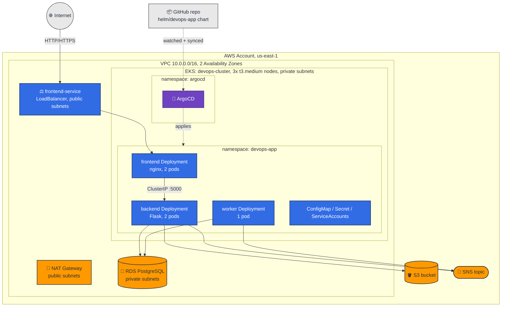

# DevOps on AWS - 3-Tier App on Kubernetes (Assignment 3)

This project runs a 3-tier app (nginx frontend, Flask backend, a background worker) on
**Kubernetes (EKS)**, backed by managed AWS services (**RDS PostgreSQL, S3, SNS**) provisioned
with **Terraform**. Deployment is fully automated with a shell script, the Kubernetes side is
packaged as a **Helm chart**, and the chart is deployed and kept in sync by **ArgoCD** (GitOps)
instead of a manual `helm upgrade`.

This is the third iteration of the project. Assignments 1-2 ran the same three services directly
on EC2 instances, configured with Ansible. That setup is gone now - `terraform/` only provisions
the managed AWS backing services (RDS, S3, SNS, IAM), and all compute happens inside the cluster.
See [History](#history) at the bottom for what changed and why.

Built solo, not in a pair.

---

## Contents

1. [Architecture](#1-architecture)
2. [Building and pushing images](#2-building-and-pushing-images)
3. [The Helm chart](#3-the-helm-chart)
4. [GitOps with ArgoCD](#4-gitops-with-argocd)
5. [Deploying: `make k8s-deploy`](#5-deploying-make-k8s-deploy)
6. [Verifying the system works](#6-verifying-the-system-works)
7. [Tearing it down: `make k8s-teardown`](#7-tearing-it-down-make-k8s-teardown)
8. [Security](#8-security)
9. [Reliability](#9-reliability)
10. [Logging](#10-logging)
11. [Trade-offs](#11-trade-offs)
12. [EKS and RDS network connectivity](#12-eks-and-rds-network-connectivity)
13. [Repository layout](#13-repository-layout)
14. [History](#history)

---

## 1. Architecture

This diagram is written in [Mermaid](https://mermaid.js.org/) and renders directly in GitHub's
Markdown preview - no exported image to keep in sync with the code, it's just text that changes
in the same commit as the architecture it describes.

Colors group nodes by who owns them: AWS-orange for managed AWS services, Kubernetes-blue for
workloads defined in the Helm chart, purple for GitOps tooling, grey for anything outside our AWS
account.



The worker has no inbound arrow on purpose - it only makes outbound calls (to RDS and SNS) and
accepts no inbound traffic at all, which is also enforced at the NetworkPolicy level (§8). Only
`frontend-service` crosses the cluster boundary to the internet; everything else is `ClusterIP`
or has no Service object at all.

* **Frontend** (`frontend-deployment` / `frontend-service`) - nginx. Serves the static UI and
  reverse-proxies `/api/*` to the backend. The only component exposed outside the cluster
  (`type: LoadBalancer`, both HTTP and self-signed HTTPS).
* **Backend** (`backend-deployment` / `backend-service`) - Flask + Gunicorn. Reads/writes RDS,
  uploads to S3, publishes to SNS. `ClusterIP` only, never reachable directly from the internet.
* **Worker** (`worker-deployment`) - polls the `items` table every `POLL_INTERVAL_SECONDS`
  (30s by default), marks pending rows as done, and sends an SNS summary. No Service object: it
  only makes outbound calls and accepts no inbound traffic at all (enforced by NetworkPolicy).

| Inside the cluster | Outside the cluster (Terraform) |
|---|---|
| frontend, backend, worker pods | RDS PostgreSQL instance |
| ArgoCD (own `argocd` namespace) | S3 bucket |
| cert-manager (own `cert-manager` namespace) | SNS topic + email subscription |
| Fluent Bit (own `amazon-cloudwatch` namespace) | CloudWatch Logs log group |
| ConfigMap / Secret / ServiceAccounts | IAM policies for S3/SNS/CloudWatch access, VPC/subnets |
| NetworkPolicies, Services, HPA, PDB | |

We use **RDS** instead of running PostgreSQL as a pod because it already existed from the earlier
assignments, and because a managed database with real backups doesn't tie the data's lifetime to
the cluster's. Running Postgres in-cluster is fine to learn from, but isn't what you'd do for data
you actually care about.

---

## 2. Building and pushing images

Each service has its own `Dockerfile`:

* Base images are pinned (`python:3.11-slim`, `nginxinc/nginx-unprivileged:1.30.4-alpine`), never
  `latest`.
* Every container runs as a **non-root user**: `appuser` (backend/worker), `USER 101` (frontend).
  The frontend uses `nginxinc/nginx-unprivileged` specifically, not the standard `nginx` image
  with a Kubernetes-level `runAsUser` override - the unprivileged image is non-root and listens on
  unprivileged ports (`8080`/`8443`) unconditionally, so it behaves identically whether it's run
  under Kubernetes or with a bare `docker run`, instead of only being safe because of an EKS host
  kernel setting.
* `.dockerignore` keeps `.git`, `.env`, `venv/`, `__pycache__` out of the build context.
* Images are scanned with **Trivy** locally during `setup.sh` (`--severity HIGH,CRITICAL`,
  non-blocking, `--exit-code 0`) if it's installed, purely for visibility during development. CI
  runs the same report *and* a second, blocking scan that fails the build on fixable `CRITICAL`
  findings (`--ignore-unfixed`, with `.trivyignore` for any documented exceptions) - see
  [§13](#13-repository-layout).
* Pushed to ECR with a pinned tag (`v1.0.0`), never `latest`.

`setup.sh` handles build, scan, tag, and push for all three images as part of the full deploy
(step 10 of 11, see [§5](#5-deploying-make-k8s-deploy)). The EKS worker nodes pull from ECR using
the node's own IAM role, so no `imagePullSecrets` are needed.

---

## 3. The Helm chart

The Kubernetes side lives entirely under `helm/devops-app/` - one chart, one release, no raw
manifests applied by hand. Templates cover: `Namespace`, `ConfigMap`, `SecretStore`,
`ExternalSecret`, `Certificate`, `ServiceAccount`, `Deployment` x3, `Service` x2, `NetworkPolicy`
x3, `PodDisruptionBudget` x2, `HorizontalPodAutoscaler` x2.

`values.yaml` only holds non-sensitive defaults (replica counts, resource requests/limits, HPA
thresholds). Anything that's real infrastructure data - the RDS endpoint, the S3 bucket name, the
Secrets Manager secret *name* holding the DB password (never the password itself, see
[§8](#8-security)) - is left blank there and supplied at deploy time (see
[§4](#4-gitops-with-argocd)). `helm/values-dynamic.example.yaml` shows the shape of those values,
for anyone who wants to `helm upgrade` by hand instead of going through ArgoCD. TLS isn't part of
this at all - cert-manager issues the frontend's certificate directly in-cluster (see §8).

A couple of deliberate choices worth calling out:

* **`frontend-sa` is a plain ServiceAccount, `backend-sa`/`worker-sa` are not templated at all.**
  They're created separately by `eksctl create iamserviceaccount` before the chart is installed,
  because IRSA needs to annotate them with an IAM role ARN that only exists once the cluster's
  OIDC provider is set up - something a chart template can't know in advance.
* **There's no `Secret` template at all.** `app-secrets` is created entirely by External Secrets
  Operator (`SecretStore` + `ExternalSecret`), which reads the real password directly from AWS
  Secrets Manager at sync time - the value never passes through this chart, Helm, or the ArgoCD
  `Application` object. See [§8](#8-security) for why this replaced an earlier, simpler approach.
* **The `Namespace` is templated in the chart, but also applied once by itself before the chart's
  first real install** (`helm template --show-only templates/namespace.yaml | kubectl apply -f -`,
  in `setup.sh` step 6). IRSA needs the namespace to exist before `eksctl create iamserviceaccount`
  can put `backend-sa`/`worker-sa` inside it - which happens before ArgoCD ever runs.

---

## 4. GitOps with ArgoCD

The app is deployed and kept in sync by **ArgoCD** watching this GitHub repository, not by a
direct `helm upgrade --install` call. `setup.sh` installs ArgoCD into its own `argocd` namespace
(idempotent - skipped if already present) and creates an `Application` resource pointing at
`helm/devops-app` on the `main` branch, with:

```yaml
syncPolicy:
  automated:
    prune: true      # remove resources that are no longer in git
    selfHeal: true    # revert manual kubectl edits back to what git says
```

Real per-run values (RDS endpoint, S3 bucket name, the Secrets Manager secret *name* holding the
DB password) can't live in git, so they're embedded directly into the generated `Application`
object's `spec.source.helm.valuesObject` instead - applied with `kubectl`, never committed. Note
that this is a resource *name*, not the password itself: the actual value is read straight from
AWS Secrets Manager by External Secrets Operator, so it's never present anywhere in this
`Application` object, readable or not (see [§8](#8-security)). ArgoCD only ever reads the chart
*templates* from git. The TLS certificate never goes through this path at all - cert-manager
issues it directly inside the cluster once the chart's `Certificate` resource is applied.

The `Application` also carries a `resources-finalizer.argocd.argoproj.io` finalizer, so deleting
it cascades: ArgoCD prunes every resource it manages before the `Application` object itself goes
away. `teardown.sh` relies on exactly this to clean up before deleting the cluster.

Once deployed, `setup.sh` prints ArgoCD's URL, admin username, and admin password. The ArgoCD UI
itself is never exposed to the internet; reaching it requires a `kubectl port-forward`.

---

## 5. Deploying: `make k8s-deploy`

```bash
make k8s-deploy      # runs setup.sh
```

`setup.sh` is fully automated end to end. Roughly what happens, in order:

1. **Pre-flight checks** - confirms `terraform`, `eksctl`, `kubectl`, `helm`, `aws`, and `docker`
   are installed (offering to auto-install the first four if missing; `aws`/`docker` are never
   auto-installed, since they're often managed separately - a venv, or Docker Desktop). Confirms
   the Docker daemon is running and AWS credentials are valid. Creates `terraform/terraform.tfvars`
   on first run, asking only for a non-sensitive S3 bucket prefix and an email address.
2. **Database password** - prompted once, with confirmation, kept in memory only. Never written
   to `terraform.tfvars` or any other file on disk. The same value flows to both RDS and its
   Secrets Manager copy (next step) from this one prompt.
3. **Terraform apply** - provisions RDS, S3, SNS, IAM, the DB password's Secrets Manager secret,
   and the VPC/subnets.
4. **EKS cluster** - created inside that same VPC (if it doesn't already exist), so RDS is
   reachable without VPC peering.
5. **VPC CNI NetworkPolicy enforcement** - enabled explicitly on the `vpc-cni` addon
   (`enableNetworkPolicy: true`). Off by default on EKS - without this, the chart's `NetworkPolicy`
   objects would exist as API objects but nothing in the cluster would actually enforce them.
6. **Firewall rule** - opens the RDS security group to the EKS cluster's security group on 5432.
7. **IRSA** - renders and applies just the chart's `Namespace` template (so it exists before
   anything needs it), associates an OIDC provider with the cluster, then creates `backend-sa` and
   `worker-sa`, each bound to its own least-privilege IAM policy (backend: S3 + SNS; worker: SNS
   only - see [§8](#8-security)).
8. **External Secrets Operator** - creates `external-secrets-sa` (IRSA, scoped to `GetSecretValue`
   on exactly the one Secrets Manager secret from step 3) and installs ESO, which the chart's
   `SecretStore`/`ExternalSecret` templates depend on to populate `app-secrets`.
9. **cert-manager** - installs cert-manager if needed and creates a self-signed `ClusterIssuer`.
   The chart's `Certificate` resource uses this later to issue the frontend's TLS cert.
10. **Fluent Bit** - creates `fluent-bit-sa` (IRSA, scoped to just this project's CloudWatch log
    group) and installs Fluent Bit, which starts shipping container logs to CloudWatch immediately.
11. **Images** - builds, scans (Trivy, if available), tags, and pushes all three images to ECR.
12. **ArgoCD** - installs ArgoCD if needed, creates the `Application`, waits for it to report
    `Synced`/`Healthy`, waits for all three Deployments to roll out, then prints the app URL,
    ArgoCD's admin credentials, and a link to the CloudWatch log group.

The whole run takes roughly 20-30 minutes on a first run, most of it waiting for the EKS cluster
to boot. Re-running it is safe: every step checks whether its target already exists before
creating anything.

---

## 6. Verifying the system works

```bash
kubectl get nodes
kubectl get namespaces
kubectl get pods -n devops-app
kubectl get deployments -n devops-app
kubectl get services -n devops-app
kubectl get ingress -n devops-app
kubectl describe pod <pod-name> -n devops-app
kubectl logs <pod-name> -n devops-app
kubectl get application devops-app -n argocd
```

`kubectl get ingress` will correctly show no resources - this project exposes the app through a
`LoadBalancer` Service instead of a Kubernetes `Ingress` object (see §8), which is one of the
options this assignment allows, not a missing piece.

Functional checks:

1. **HTTP/HTTPS access** - open the URL `setup.sh` prints (or `kubectl get svc frontend-service
   -n devops-app`). The HTTPS cert is self-signed, so the browser will warn - that's expected.
2. **Frontend to backend** - creating an item in the UI calls `POST /api/items` through nginx's
   reverse proxy.
3. **App to RDS** - `GET /api/health` returns `{"db": "reachable"}`. New items start as `pending`
   and flip to `done` after the worker's next poll cycle.
4. **S3** - uploading a file returns an `s3_key`/`s3_url` in the response.
5. **SNS** - creating an item or uploading a file sends an email alert (once the SNS subscription
   is confirmed).
6. **Resilience** - `kubectl delete pod <backend-pod> -n devops-app`: the Deployment recreates it,
   the readiness probe gates traffic until `/api/health` succeeds again, and the frontend keeps
   serving throughout since it has 2 replicas.
7. **GitOps** - `kubectl get application devops-app -n argocd` should show `Synced`/`Healthy`. A
   manual `kubectl edit` to a Deployment gets reverted automatically within a few minutes (selfHeal).
8. **NetworkPolicy is actually enforced, not just defined** - with VPC CNI NetworkPolicy support
   enabled (step 4 of `setup.sh`), a pod without the `app: frontend` label should be refused when
   it tries to reach the backend directly:
   ```bash
   kubectl run netpol-test -n devops-app --rm -it --image=busybox --restart=Never -- \
     wget -qO- --timeout=5 http://backend-service:5000/api/health
   ```
   This should time out. The same request from a pod labeled `app: frontend` succeeds.

*(Screenshots and text captures of the commands above are in `Screenshots+txt_Files/01-Required-Commands/`
and `02-Functional-Checks/`.)*

---

## 7. Tearing it down: `make k8s-teardown`

```bash
make k8s-teardown     # runs teardown.sh
```

Run this when you're done, since the EKS control plane, the RDS instance, and any LoadBalancer
all bill hourly. Order matters here more than it looks:

1. Delete the ArgoCD `Application` (its finalizer cascades to remove the actual app resources,
   including the frontend's LoadBalancer Service), then the `devops-app` namespace. ArgoCD itself
   is left alone - it has no AWS resources of its own, so the cluster deletion in step 5 removes
   it for free.
2. Wait for the AWS load balancer to fully release. Deleting the Service only removes the
   Kubernetes object; the actual ELB is cleaned up asynchronously by a controller inside the
   cluster, and deleting the cluster too early orphans it.
3. Revoke the RDS security-group rule that references the EKS cluster's security group, so EKS
   can clean up its own security group properly.
4. Delete the IRSA IAM roles for `backend-sa`/`worker-sa`/`fluent-bit-sa`/`external-secrets-sa`
   (separate CloudFormation stacks from the cluster itself).
5. Delete the EKS cluster.
6. `terraform destroy` - removes RDS, S3, SNS, IAM, and the VPC.
7. Remove the local `terraform.tfvars` (recreated on the next `setup.sh` run).

---

## 8. Security

**ServiceAccounts and IRSA.** `frontend-sa` is a plain ServiceAccount with no AWS access at all -
it never needs any. `backend-sa` and `worker-sa` each get their own IAM role via IRSA (IAM Roles
for Service Accounts): short-lived, auto-rotated tokens instead of long-lived access keys sitting
in a Kubernetes Secret. The two roles use **separate**, workload-scoped policies rather than one
shared policy - `backend-sa` gets `s3:PutObject`/`s3:ListBucket` on this project's one bucket plus
`sns:Publish` on its one topic; `worker-sa` gets `sns:Publish` only, since `worker.py` never
touches S3 at all. `fluent-bit-sa` (cluster infrastructure, not part of the app - see
[§10](#10-logging)) and `external-secrets-sa` (below) each get their own separate roles too, scoped
to exactly one thing each: writing to this project's one CloudWatch log group, and reading this
project's one Secrets Manager secret, respectively. No workload has any Kubernetes RBAC
permissions beyond the defaults; none of them call the Kubernetes API.

**Secrets.** The only thing in the Kubernetes `Secret` is `DB_PASSWORD`, and it's no longer
created directly at all - **External Secrets Operator** reads the real value straight from **AWS
Secrets Manager** and writes the `app-secrets` Secret itself. The chart's `SecretStore` (points ESO
at Secrets Manager, authenticating as the ESO controller's own IRSA-bound `external-secrets-sa` -
no per-store credential needed) and `ExternalSecret` (syncs one key, `DB_PASSWORD`, on a 1-hour
refresh interval) replace what used to be a plain `Secret` template fed a pre-base64-encoded value
through the ArgoCD `Application` spec.

That earlier approach had a real gap: the password was embedded in the `Application` object's
`spec.source.helm.valuesObject`, which persists as a live, readable cluster object - anyone with
permission to `kubectl get application devops-app -n argocd -o yaml` could read it directly,
base64 decoding being trivial. Now the `Application` object only ever holds a Secrets Manager
secret *name*, never a value; the actual password is fetched by ESO at sync time and never passes
through Helm, ArgoCD, or this repository at any point. `terraform/secrets.tf` provisions the
Secrets Manager secret from the same `db_password` Terraform variable already used for RDS - one
password prompt in `setup.sh`, flowing to both places.

AWS credentials never touch a Kubernetes Secret at all in this project, in either the old or new
approach - IRSA replaces them entirely, everywhere.

`helm/devops-app/secret.example.yaml` documents the resulting Secret's shape and where its value
actually comes from, since there's no `kubectl create secret` step to point at anymore - ESO
creates and refreshes it automatically once the `ExternalSecret` exists.

**Network policies.** Frontend accepts ingress from anywhere (it's the public entry point) but
egress only to the backend and DNS. Backend accepts ingress only from pods labeled `app: frontend`.
Worker denies all ingress - it only ever makes outbound calls. These are enforced, not just
defined: EKS ships the VPC CNI with `NetworkPolicy` enforcement **disabled** by default, so
`setup.sh` explicitly enables it on the `vpc-cni` addon (`enableNetworkPolicy: true`, step 4)
before anything else gets deployed. Without that, these three `NetworkPolicy` objects would exist
as API objects with no effect at all - see [§6](#6-verifying-the-system-works) for the negative
connectivity test proving enforcement is actually active. RDS isn't a Kubernetes object, so it's
protected at the AWS layer instead: its security group only allows inbound `5432` from the EKS
cluster's own security group, never `0.0.0.0/0`, and the instance itself is not publicly
accessible.

**Containers.** Every container sets `runAsNonRoot`, `allowPrivilegeEscalation: false`,
`readOnlyRootFilesystem: true`, and drops all Linux capabilities. Wherever a container needs to
write at runtime, it gets an explicit writable `emptyDir` instead of a writable root filesystem -
nginx's cache/pid directories, and a `/tmp` for the backend's upload spooling and the worker's
heartbeat file. The frontend's non-root behavior isn't only a Kubernetes-level override either:
its image is `nginxinc/nginx-unprivileged`, which is non-root and listens on unprivileged ports by
default, so the same guarantee holds under a bare `docker run` too (see [§2](#2-building-and-pushing-images)).

**Images.** Built from this repo's own Dockerfiles (nothing pulled pre-built from Docker Hub),
pinned base images and tags, scanned with Trivy before push - locally for visibility only, in CI
also as a blocking gate on fixable `CRITICAL` findings (see [§13](#13-repository-layout)).

**AWS resource security.** RDS storage and the SNS topic are both encrypted at rest with
AWS-managed KMS keys; the S3 bucket has SSE-S3 encryption and a full public access block (nothing
in this project ever needs a public S3 URL - the backend talks to it through IRSA). All of this,
plus the two public subnets' `map_public_ip_on_launch`, is checked automatically by `trivy config`
in CI - see [§13](#13-repository-layout). Customer-managed KMS keys would satisfy stricter
scanners too, but cost ~$1/month each for marginal benefit on data that isn't sensitive, so that
specific finding is suppressed with a documented reason rather than fixed (`terraform/data.tf`).

**Ingress/TLS.** Exposure is a plain `Service` of `type: LoadBalancer`, not a Kubernetes `Ingress`
resource - there's only one public route, so an ingress controller would be overhead without
benefit here. HTTPS is served with a certificate issued by **cert-manager**, from a `Certificate`
resource in the chart (`helm/devops-app/templates/certificate.yaml`) against a `selfSigned`
`ClusterIssuer`. Browsers still show a "not trusted" warning, since there's no real domain name
pointed at the load balancer to get a certificate from a real CA - but the cert itself is now
issued and auto-renewed declaratively by cert-manager instead of a one-off `openssl` command in a
bash script, which is the same mechanism a real ACME/Let's Encrypt setup would use, just pointed
at a self-signed issuer instead of a trusted one. There's no WAF or rate limiting in front of the
load balancer.

---

## 9. Reliability

* **Readiness/liveness probes** on all three Deployments, deliberately not identical between the
  two where it matters. Backend's *readiness* probe hits `/api/health`, which opens a real RDS
  connection - if RDS is briefly unreachable, the pod should stop receiving traffic. Its
  *liveness* probe hits a separate `/healthz` instead, which checks nothing but "is the Flask
  process still serving requests" - a transient RDS blip shouldn't get a perfectly healthy pod
  killed and restarted over a dependency outage that isn't its fault. The worker has no HTTP port,
  so it probes a heartbeat file it touches at startup and after every poll cycle; liveness fails if
  that file goes stale for more than 3x `POLL_INTERVAL_SECONDS` - read from the same environment
  variable `worker.py` itself uses, not a hardcoded number, so the threshold can't silently drift
  out of sync if the poll interval ever changes.
* **HorizontalPodAutoscaler** on frontend and backend (2-4 replicas, scaling on CPU utilization).
  The worker has no HPA - it's a single background poller by design, not something that needs to
  scale with request load.
* **PodDisruptionBudget** on frontend and backend (`minAvailable: 1`), so voluntary disruptions
  like node drains don't take both replicas down at once. The worker has no PDB: with only one
  replica, `minAvailable: 1` would forbid ever evicting it, blocking node drains instead of just
  slowing them down.
* **ArgoCD selfHeal** reverts drift from the declared state automatically, and `prune: true`
  removes anything that's no longer in git.

---

## 10. Logging

Container logs (all three services) are shipped to **CloudWatch Logs** by **Fluent Bit**, running
as a DaemonSet via AWS's own `aws-for-fluent-bit` chart. Like ArgoCD and cert-manager, this is
cluster infrastructure installed directly by `setup.sh`, not part of `helm/devops-app` - it isn't
application logic, and none of the three services need to know it exists.

* **The log group is Terraform-managed** (`terraform/logging.tf`), not auto-created by Fluent Bit.
  That keeps its lifecycle tied to `terraform destroy` like every other piece of infrastructure in
  this project, rather than becoming a resource that only Fluent Bit knows how to clean up. A
  7-day retention period keeps CloudWatch storage cost bounded.
* **IRSA, same as everywhere else.** `fluent-bit-sa` gets its own IAM role, scoped to exactly
  `logs:CreateLogStream`, `logs:PutLogEvents`, and `logs:DescribeLogStreams` on this project's one
  log group - no `logs:CreateLogGroup`, since Fluent Bit never needs to create one itself.
* **Where to look:** the CloudWatch Logs console, log group `/devops-app/containers` (`setup.sh`
  prints a direct link at the end of a deploy), or `kubectl logs` for anything still running.

This is deliberately basic - one shared log group for all three services, not scoped per-namespace
or per-service, since that's what the assignment actually asks for. Splitting it further (per-app
log groups, structured JSON parsing, log-based metrics) would be the natural next step for
something closer to production.

---

## 11. Trade-offs

| Decision | Why | Cost |
|---|---|---|
| RDS instead of in-cluster Postgres | Reuse an existing managed DB with real backups | One more AWS resource to run and pay for |
| IRSA instead of static AWS keys in a Secret | Short-lived credentials, no manual rotation | Requires an OIDC provider and per-SA IAM roles |
| Helm chart instead of raw manifests | Single source of truth, reusable values | A little more indirection to read through |
| ArgoCD instead of `helm upgrade` in the script | Real GitOps: drift correction, auditable history | Another component running in the cluster |
| `LoadBalancer` Service instead of Ingress | Only one public route, no controller needed | No path-based routing |
| cert-manager with a self-signed issuer, not a real CA | No domain name to get a real cert for; cert-manager itself is still real | Browser warning on every visit |
| External Secrets Operator + AWS Secrets Manager, not a plain Kubernetes Secret | The password never has to pass through Helm, ArgoCD, or this repo at any point, and gets real encryption at rest | Another operator running in the cluster, another IAM role to manage |
| 3 nodes instead of 2 | Pod ceiling per node is set by network interface IP limits, not CPU/memory - kube-system + ArgoCD + cert-manager + this app need more than 2 nodes' worth of slots | Small added hourly node cost |
| `t3.medium` nodes instead of `t3.small` (bumped for Assignment 4) | Adding Jenkins (a resident controller Pod, a resident webhook-relay Pod, and bursts of ephemeral CI/CD agent Pods) on top of an already-tight `t3.small` cluster (11 pods/node) risked agent Pods stuck `Pending` mid-build; `t3.medium` doubles memory per node and raises the ceiling to 17/node for the same node count | Roughly doubles hourly node cost |
| One shared CloudWatch log group, not per-service | This is basic logging, not a full observability stack | Harder to filter one service's logs out from the others |
| AWS-managed KMS keys, not customer-managed | S3/SNS encrypted at rest either way | Doesn't satisfy scanners requiring CMKs; ~$1/month each to fix |
| CI fails only on fixable `CRITICAL` image findings, not `HIGH` too | `HIGH` findings are still reported (non-blocking) for visibility; failing on every `HIGH` finding would block the pipeline on OS-level CVEs this project alone can't fix | A fixable `HIGH` vulnerability won't block a merge on its own |

---

## 12. EKS and RDS network connectivity

By default, `eksctl create cluster` builds its own new VPC, separate from the one Terraform
creates for RDS. Two things make them work together:

1. **Same VPC, 2 Availability Zones.** EKS requires its control plane to span at least 2 AZs.
   `terraform/network.tf` provisions 2 public and 2 private subnets across 2 AZs; `setup.sh` reads
   their IDs from Terraform's outputs and passes them straight to
   `eksctl create cluster --vpc-public-subnets=... --vpc-private-subnets=...`, so the cluster is
   built inside the exact same VPC RDS already lives in. No VPC peering needed.
2. **Firewall rule.** After the cluster exists, `setup.sh` looks up its security group and adds a
   rule to RDS's security group allowing inbound `5432` from it. This can't be done by Terraform
   alone, since the cluster (and its security group) doesn't exist yet at `terraform apply` time.
   `terraform/security.tf` marks that security group's `ingress`/`egress` as `ignore_changes`, so
   a later `terraform apply` doesn't wipe out the rule `setup.sh` added out of band.
3. **`--node-private-networking`.** Passing both subnet types to `eksctl` only tells it which
   subnets exist in the VPC - without this flag, the managed node group can still land in the
   public ones, and since `map_public_ip_on_launch` is `true` there, every node would get a real
   public IP. This flag forces the node group into the private subnets specifically, with no
   public IP at all; the NAT Gateway (already routed from the private route table) still gives
   them outbound internet access for pulling images and reaching the EKS API.

---

## 13. Repository layout

```
setup.sh, teardown.sh      Full deploy / full teardown automation
Makefile                   make k8s-deploy / make k8s-teardown / raw terraform targets
.github/workflows/ci.yml   terraform validate + helm lint + Trivy on every push/PR
.trivyignore               Accepted-risk CVE allowlist for image scanning (empty - nothing needed yet)
terraform/                 RDS, S3, SNS, Secrets Manager, CloudWatch log group, IAM policies,
                           VPC/subnets - no compute
helm/devops-app/           The Kubernetes side: one Helm chart, deployed via ArgoCD
helm/values-dynamic.example.yaml   Template for deploying the chart by hand, bypassing ArgoCD
frontend/                  nginx (unprivileged), static UI, reverse proxy to backend
backend/                   Flask + Gunicorn API (RDS, S3, SNS)
worker/                    Background poller (RDS, SNS)
Screenshots+txt_Files/     Evidence captures: required commands, functional checks,
                           resilience test, and bonus objectives (see §6)
```

**CI** (`.github/workflows/ci.yml`) runs `terraform fmt`/`validate`, `helm lint` plus a full
`helm template` render, builds + Trivy-scans all three images, and runs `trivy config` against
both `terraform/` and `helm/devops-app/` for misconfigurations - on every push and pull request to
`main`. It's validation only, deliberately - this repo is public, and wiring real AWS credentials
into Actions secrets so every push could deploy to live infrastructure is a different risk profile
than read-only checks. Actual deployment stays a manual `make k8s-deploy`.

The `trivy config` job, and now the image scan too, are both blocking. Image scanning runs twice:
once reporting `HIGH`+`CRITICAL` non-blocking (saved as a build artifact for each service, purely
for visibility - unfixable CVEs included), and once scoped to fixable `CRITICAL` findings only
(`--ignore-unfixed`) that fails the build if it finds one. Accepted-risk exceptions go in
`.trivyignore` with a documented reason, not a blanket `exit-code` override. Every misconfiguration
`trivy config` currently knows about in this repo has already been fixed or explicitly suppressed
with a documented reason in the code itself; a clean run should always pass.

---

## History

Assignments 1-2 ran the app on three EC2 instances in a strict 3-tier layout: a frontend server
(also acting as an SSH bastion), a private backend server, and a private worker server, all
configured by Ansible over SSH. Terraform provisioned the VPC, the instances, RDS/S3/SNS, and the
IAM instance profile; Ansible installed nginx and a TLS cert on the frontend, deployed the Python
services as systemd units, and ran post-deploy health checks.

None of that runs the app anymore. The EC2 instances and Ansible playbooks have been removed from
this repository entirely - `terraform/` now only provisions the managed AWS services this
Kubernetes deployment still depends on (RDS, S3, SNS, the IAM policy, and the networking). Compute
moved to EKS, and deployment moved from a hand-run Ansible playbook to a Helm chart kept in sync
by ArgoCD.

A later hardening pass, prompted by an external technical review of this same submission,
addressed: NetworkPolicy objects that existed but weren't actually enforced (VPC CNI policy
support is off by default on EKS); the DB password being readable from the ArgoCD `Application`
object (replaced with External Secrets Operator + AWS Secrets Manager); a shared IAM policy
between backend and worker (split by actual least-privilege need); the frontend image having no
non-root user of its own (switched to `nginxinc/nginx-unprivileged`); backend's liveness probe
failing on RDS outages instead of just its readiness probe; a non-blocking CI image scan; and a
few smaller code-quality fixes (a connection-leak pattern, a tuple-instead-of-scalar bug, pinned
`eksctl`/ArgoCD versions instead of `latest`/`stable`).
