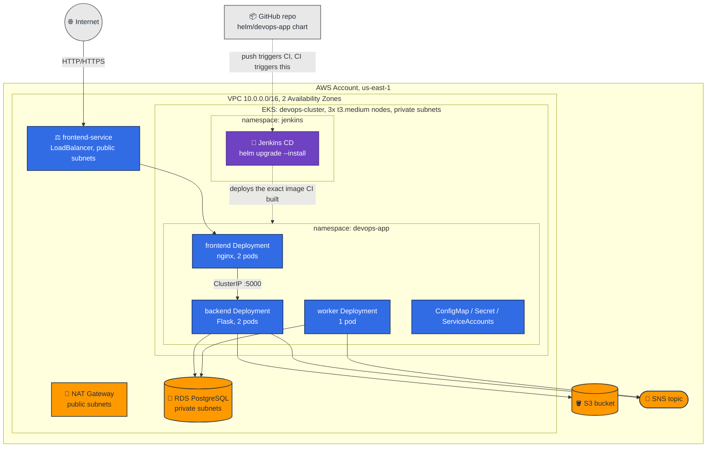

# DevOps on AWS - Jenkins CI/CD on Kubernetes (Assignment 4)

This project is a self-hosted **Jenkins** running inside **Kubernetes (EKS)**, building and
deploying a 3-tier app (nginx frontend, Flask backend, a background worker) through two separate
pipelines: a real Git-push-triggered **CI** pipeline that builds, tests, scans, and pushes
immutable-tagged Docker images, and a separate **CD** pipeline that deploys the exact image CI
built via `helm upgrade --install`, verifies the rollout, and smoke-tests the result.

The app itself, its Helm chart, and the AWS infrastructure it runs on (RDS, S3, SNS, the VPC) come
from earlier work in this rolling project - see [§12](#12-supporting-infrastructure) for how that's
built, deployed, and torn down, and [History](#13-history) for how the project got here. This
README is about Assignment 4: Jenkins CI/CD.

Built solo, not in a pair.

---

## Contents

1. [Architecture and environment choice](#1-architecture-and-environment-choice)
2. [Prerequisites and versions](#2-prerequisites-and-versions)
3. [Installing Jenkins from code](#3-installing-jenkins-from-code)
4. [Jenkins Configuration as Code (JCasC)](#4-jenkins-configuration-as-code-jcasc)
5. [CI Pipeline](#5-ci-pipeline-jenkinscijenkinsfile)
6. [CD Pipeline](#6-cd-pipeline-jenkinscdjenkinsfile)
7. [Jobs as code, and how CI connects to CD](#7-jobs-as-code-and-how-ci-connects-to-cd)
8. [Credentials and secrets](#8-credentials-and-secrets)
9. [Security](#9-security)
10. [Cleanup](#10-cleanup)
11. [Trade-offs](#11-trade-offs)
12. [Supporting infrastructure](#12-supporting-infrastructure)
13. [History](#13-history)

---

## 1. Architecture and environment choice

Jenkins runs in the same `devops-cluster` EKS cluster as the app (a separate cluster was the other
option the assignment allows, but would mean a second cluster's worth of cost and a cross-cluster
credential the CD pipeline would need to manage, for no real isolation benefit at this scale - the
`jenkins` and `devops-app` namespaces already provide the separation that matters: distinct RBAC,
distinct ServiceAccounts, no shared secrets).

```
jenkins namespace                          devops-app namespace
┌─────────────────────────────┐            ┌──────────────────────────┐
│ jenkins-0 (controller)       │            │ frontend/backend/worker  │
│  - never runs builds         │            │  deployments             │
│  - PVC: jenkins home (8Gi)   │            │                          │
│ webhook-relay                │  CD agent  │                          │
│                               │  deploys → │                          │
│ ci-agent Pod (ephemeral)  ────┼── pushes ─→│ ECR (958...:us-east-1)  │
│ cd-agent Pod (ephemeral)  ────┼───────────→│                          │
└─────────────────────────────┘            └──────────────────────────┘
```

**Security boundary**: the Jenkins UI has no public IP, Ingress, or LoadBalancer - it's a plain
`ClusterIP` Service, reachable only via `kubectl port-forward` (see [§9](#9-security)).
Inbound webhook traffic never reaches Jenkins directly either: GitHub POSTs to a public
[smee.io](https://smee.io) channel, and a `webhook-relay` Deployment inside the cluster holds an
*outbound* connection to that channel and forwards matching events to Jenkins' internal
`/github-webhook/` endpoint over the in-cluster network. Jenkins ends up with zero inbound ports
open to the internet, in either direction.

**How CD authenticates to the target cluster**: since Jenkins and the app share a cluster, the CD
agent Pod authenticates via its own `cd-deploy-sa` Kubernetes ServiceAccount token (automatically
mounted, in-cluster) - no kubeconfig, no static credential, nothing to rotate. If the target were a
different cluster, this would instead need a stored kubeconfig/token as a Jenkins Credential, scoped
as narrowly as `cd-deploy-sa` is now.

---

## 2. Prerequisites and versions

| Tool | Version | Where pinned |
|---|---|---|
| EKS cluster | Kubernetes 1.34 | `setup.sh` (`eksctl create cluster`) |
| Jenkins controller image | `jenkins/jenkins:2.541.3-lts-jdk17` | `jenkins/values.yaml` |
| Jenkins Helm chart | `5.9.54` (jenkinsci/jenkins) | `jenkins/scripts/install-jenkins.sh` |
| eksctl | `v0.229.0`/`0.230.0` | `setup.sh`, `jenkins/scripts/install-jenkins.sh` |
| Helm | `v3.21.4` | client-side, any recent 3.x |
| kubectl / aws-cli | any recent version | client-side |
| Cosign | `v3.1.3` (static binary, fetched at runtime by the CI agent) | `jenkins/ci/Jenkinsfile` |

Also requires: an EKS cluster and `devops-app` namespace already brought up via this repo's own
`setup.sh` (Jenkins is layered on top of that infra - see [§12](#12-supporting-infrastructure) - it
doesn't create a cluster itself), and a GitHub repository with permission to add a webhook.

---

## 3. Installing Jenkins from code

Five scripts, each idempotent (safe to re-run) and each doing exactly one thing:

```bash
bash jenkins/scripts/install-jenkins.sh     # namespace, RBAC, ci-build-sa, EBS CSI driver +
                                             # StorageClass, the Jenkins Helm release + JCasC
bash jenkins/scripts/configure-jenkins.sh   # prints admin password, mints the smee.io channel,
                                             # deploys webhook-relay, creates the webhook secret
bash jenkins/jobs/create-jobs.sh            # creates/updates ci-application + cd-application
                                             # via Jenkins' REST API (needs a port-forward - see below)
bash jenkins/scripts/verify-jenkins.sh      # read-only health check against everything above
bash jenkins/scripts/uninstall-jenkins.sh   # removes Jenkins only - app and cluster untouched
```

`create-jobs.sh` needs Jenkins reachable at `http://localhost:8080`:

```bash
kubectl port-forward svc/jenkins -n jenkins 8080:8080 &
bash jenkins/jobs/create-jobs.sh
```

None of this is done through the Jenkins UI. `install-jenkins.sh` applies RBAC and IRSA from files
in this repo, then installs the official `jenkinsci/jenkins` Helm chart with
[JCasC](https://github.com/jenkinsci/configuration-as-code-plugin) (`jenkins/values.yaml`) driving
the plugin list, the Kubernetes cloud, and both agent pod templates - the controller comes up
already fully configured, no manual "click through setup wizard" step exists. `create-jobs.sh`
creates the two jobs from the `config.xml` files in `jenkins/jobs/` via Jenkins' own REST API - the
one alternative to a Job DSL seed job or a Multibranch Pipeline, and the one this project uses
because an earlier attempt at a JCasC-driven seed job crashed the controller's entire boot
sequence on a syntax slip (see `jenkins/values.yaml`'s own comment): a bug in job creation now
only fails `create-jobs.sh`, never brings the controller down.

**A note on Windows**: if running these scripts from Git Bash on Windows, `kubectl exec ... --
/bin/cat ...` needs `MSYS_NO_PATHCONV=1` set (already done inside the three scripts that need it) -
without it, MSYS rewrites the Unix path argument into a Windows path before it reaches the
container. No-op on Linux/Mac.

---

## 4. Jenkins Configuration as Code (JCasC)

Everything under `controller.JCasC.configScripts` in `jenkins/values.yaml` becomes live controller
configuration on boot - no manual System Config page was ever touched:

- **Kubernetes cloud** (`devops-agents`): where ephemeral agent Pods get scheduled from, pointed at
  the in-cluster API server, capped at 10 concurrent agent Pods, `podRetention: never` (agents are
  deleted immediately after their build, not kept around).
- **Agent templates**: `ci-agent` (three containers - `python` for lint/test/signing, `kaniko` for
  the image build, `trivy` for the image scan/SBOM; `serviceAccount: ci-build-sa`) and `cd-agent`
  (one `deploy` container with `kubectl`+`helm`; `serviceAccount: cd-deploy-sa`). Both templates set
  explicit `resourceRequest*`/`resourceLimit*` on every container. No fourth container for Cosign -
  its only official image is distroless (no shell), which breaks the idle-container-then-`exec`
  pattern every other tool here uses, so the CI pipeline fetches the static binary into the existing
  `python` container at runtime instead (§5). The same `ci-agent` template is also what each
  parallel matrix cell in §5's Build/Scan/Sign stage requests a fresh Pod from - no separate
  template needed for that either.
- **Plugin list**: `kubernetes`, `kubernetes-credentials-provider`, `workflow-aggregator`, `git`,
  `github`, `job-dsl`, `configuration-as-code`, `credentials-binding`, `timestamper`, `ws-cleanup` -
  named only, no individual version pins (an earlier attempt pinning each plugin's version hit a
  `ClassNotFoundException` from mutually-incompatible pinned versions; the installer resolves a
  compatible set for a given Jenkins core version far more reliably than hand-pinning each one).

---

## 5. CI Pipeline (`jenkins/ci/Jenkinsfile`)

Trigger: `triggers { githubPush() }`, wired to the job via `com.cloudbees.jenkins.GitHubPushTrigger`
in `jenkins/jobs/ci-application-config.xml` (the trigger has to be declared there too - `githubPush()`
alone inside the Jenkinsfile isn't enough for Jenkins to register it as a live trigger before a
first build has already run with it configured).

| Stage | What it does |
|---|---|
| Checkout | Pulls the repo, computes `IMAGE_TAG` = short (8-char) commit SHA |
| Validation | Confirms every service's `Dockerfile`/`.dockerignore` and the Helm chart exist |
| Static Analysis / Lint | `pyflakes` against `backend/app.py` and `worker/worker.py` |
| Tests | `pytest` against `backend/test_app.py`, results published via `junit` |
| **Build, Scan, Sign** (`matrix`) | Runs once per service (`frontend`/`backend`/`worker`), each cell on its **own freshly-provisioned `ci-agent` Pod** - genuine parallel builds, not three processes sharing one container. Each cell: **Build** (Kaniko builds and pushes that one image - no Docker socket, see [§9](#9-security)), **Scan + SBOM** (Trivy scans the pushed image - HIGH+CRITICAL reported non-blocking and archived, fixable CRITICAL findings fail that cell's build - and generates a CycloneDX SBOM, archived as `sbom-<service>.json`), **Sign** (Cosign signs the image *by digest* with the project's AWS KMS key), **Publish Metadata** (archives `image-metadata-<service>.txt`: tag, digest, signed status) |

Runs on the `ci-agent` template as `ci-build-sa` (IRSA - pushes to/pulls from ECR and signs via
AWS KMS through a real AWS IAM role, no static credential anywhere in the pipeline). Images are
tagged with the immutable 8-char commit SHA - never `latest` - and the three ECR repos are
`IMAGE_TAG_MUTABILITY: IMMUTABLE` (`terraform/ecr.tf`), so even a mistake can't silently overwrite a
tag already in use. A failed Test/Lint/Build/Scan/Sign cell fails the whole build (Declarative
Pipeline's default, including matrix cells) and never reaches the `success` post-block that triggers
CD - so a scan failure still guarantees nothing gets deployed, even though (see
[§11](#11-trade-offs)) Kaniko's build and push happen as one atomic step, before the scan runs.

**Signing**: `cosign sign --key awskms:///alias/devops-app-cosign --yes <image>@<digest>` - signs
the immutable digest, not the mutable tag, using an asymmetric KMS key (`terraform/kms.tf`) with no
private key material anywhere, ever. `ci-build-sa` gets exactly three KMS actions
(`DevOps-CI-Cosign-Sign-Policy` in `terraform/iam.tf`): `GetPublicKey`, `DescribeKey`, `Sign` -
nothing that could delete or manage the key itself. Verifying a signature is a one-liner
(`cosign verify --key awskms:///alias/devops-app-cosign <image>@<digest>`) but isn't wired into a
CD gate - the assignment's bonus asks for signing, not a verify-or-block deploy step, and adding one
would be scope beyond what was asked (see [§11](#11-trade-offs)).

---

## 6. CD Pipeline (`jenkins/cd/Jenkinsfile`)

Never builds an image, never touches application source - checks out only to read the Helm chart.
Takes one parameter, `IMAGE_TAG`, and refuses to run without one or with `latest`. Deploys directly
via `helm upgrade --install` - an earlier version of this project used ArgoCD/GitOps for this
instead; see [History](#13-history) for why that changed.

| Stage | What it does |
|---|---|
| Checkout | Pulls the Helm chart only |
| Input Validation | Rejects a missing or `latest` `IMAGE_TAG` |
| Load infra config | Reads `dbHost`/`s3BucketName`/`snsTopicArn`/`dbPasswordSecretName` from the `terraform-outputs` ConfigMap `setup.sh` publishes in `devops-app` (these change every `terraform apply`, so they're read at deploy time, never hardcoded) |
| Manifest Validation | `helm lint --strict` + a full `helm template` render |
| Deploy | `helm upgrade --install devops-app ./helm/devops-app --set image.tag=$IMAGE_TAG ... --wait --timeout 10m` |
| Rollout | `kubectl rollout status` on all three Deployments |
| Verify | Confirms every Pod's image ends in `:$IMAGE_TAG` - fails the build if any doesn't |
| Smoke Test | Real HTTP request to the frontend LoadBalancer, retried for up to 2 minutes while its DNS propagates |

Runs on the `cd-agent` template as `cd-deploy-sa` - a plain (non-IRSA) ServiceAccount, since it only
ever calls the in-cluster Kubernetes API, never an AWS API directly.

**Traceability**: a CD build's console log shows exactly who triggered it
(`currentBuild.getBuildCauses()`), the image tag, target namespace/cluster, and - if triggered by
CI - the CI build that produced that tag is one click away (`ci-application`'s own build history,
keyed by the same commit SHA that *is* the image tag). `kubectl get pods -n devops-app -o
jsonpath='{..image}'` independently confirms the deployed tag matches.

**Automated rollback**: `post { failure { ... } }` in `cd-Jenkinsfile` runs
`helm rollback devops-app -n devops-app --wait --timeout 5m` for real, automatically, whenever
Deploy has already applied a new Helm revision and something afterward goes wrong (Deploy itself
timing out, or a subsequent Rollout/Verify/Smoke Test failure) - guarded by an `env.HELM_DEPLOYED`
flag set right after `helm upgrade --install` succeeds, so an earlier failure (bad `IMAGE_TAG`, a
`helm lint` error) that never touched the cluster correctly does *not* trigger a rollback of a
revision that was never replaced. If the rollback itself fails, the build's console log still shows
exactly where it broke; there was never a scenario tested where the previous revision was itself
unhealthy, since CI's own scan gate keeps that from happening in the first place.

---

## 7. Jobs as code, and how CI connects to CD

Both jobs are created via `jenkins/jobs/create-jobs.sh` calling Jenkins' REST API with the
`config.xml` files in that same directory - `POST .../createItem` if the job doesn't exist yet,
`POST .../config.xml` (an update) if it does, so re-running after editing a Jenkinsfile or a
`config.xml` is a normal, safe operation. Creating either job by hand through the Jenkins UI is
explicitly out of scope for this assignment and isn't how these two ever get created here.

CI connects to CD via `build job: 'cd-application', parameters: [string(name: 'IMAGE_TAG', value:
env.IMAGE_TAG)], wait: false` in `ci-Jenkinsfile`'s `post { success { ... } }` block - CI hands CD
the exact tag it just pushed, `wait: false` so CI's own build finishes and frees its agent Pod
immediately rather than blocking on the entire CD run. Even though CD fires automatically, it still
exists as its own job with its own Jenkinsfile, satisfying the assignment's requirement that CI and
CD stay visibly separate pipelines.

---

## 8. Credentials and secrets

| Where a secret lives | How |
|---|---|
| ECR push (CI) | IRSA (`ci-build-sa` → `DevOps-CI-ECR-Push-Policy`) - no static credential exists |
| kubectl/helm access (CD) | `cd-deploy-sa`'s own ServiceAccount token, auto-mounted in-cluster |
| DB password | AWS Secrets Manager, read by External Secrets Operator - never touches Jenkins at all |
| GitHub webhook signature | Jenkins Credential `git-webhook-secret` (Secret text), created from a Kubernetes Secret labeled `jenkins.io/credentials-type: secretText` - picked up automatically by the Kubernetes Credentials Provider plugin, no JCasC edit or restart needed |

`jenkins/secrets/credentials.example.yaml` documents the one credential this project expects to
exist and what it's for - never a real value. `configure-jenkins.sh` generates the actual webhook
secret at runtime (`openssl rand -hex 20`), prints it once, and never writes it to git; the
credential is idempotent to re-run (an existing `git-webhook-secret` Secret is left alone rather
than rotated, so it never desyncs from what's actually configured on GitHub's side).

**To replace/revoke a credential**: delete the Kubernetes Secret it's backed by
(`kubectl delete secret git-webhook-secret -n jenkins`), re-run `configure-jenkins.sh` to mint a
new one, and update the webhook's secret on the GitHub side to match. No Jenkins restart needed -
the Credentials Provider plugin watches for the Secret to reappear.

Console log masking: Jenkins' `credentials-binding` plugin masks any credential value it injects
automatically. Nothing in either Jenkinsfile ever echoes a credential directly, and image tags/ECR
URLs/namespaces are all non-secret by design (see [§2](#2-prerequisites-and-versions) table),
so there's nothing sensitive to accidentally print in the first place.

---

## 9. Security

**RBAC**: no `cluster-admin` anywhere. `jenkins-controller` (Role, namespace-scoped to `jenkins`)
can only manage Pods/PVCs/events in its own namespace and read Secrets/ConfigMaps there - it never
gets `devops-app` access, since the controller itself never deploys anything. `cd-deploy-sa` (Role,
namespace-scoped to `devops-app`) can manage exactly the resource types Helm needs there
(Deployments, Services, ConfigMaps, Secrets, Ingresses, NetworkPolicies, HPAs, Certificates,
ExternalSecrets) - plus one unavoidable narrow `ClusterRole`, `get`-only and `resourceNames`-scoped
to exactly `devops-app`, since a namespace-scoped Role can never grant access to the (cluster-scoped)
Namespace object itself, which `helm upgrade --install` always checks for regardless of
`--create-namespace`. `ci-build-sa` needs no Kubernetes RBAC at all - Kaniko builds are pure
container-filesystem work, it never calls the Kubernetes API.

**Container/agent security**: no build ever runs on the controller (`numExecutors: 0` -
structurally impossible, not just discouraged). No agent mounts the node's Docker socket - CI
builds with Kaniko (daemonless OCI image builds), CD uses a prebuilt `kubectl`+`helm` image. Every
container in both agent templates sets explicit CPU/memory requests and limits. The webhook-relay
Pod runs as `runAsNonRoot`, `allowPrivilegeEscalation: false`, all capabilities dropped, read-only
root filesystem. The Jenkins controller itself runs under the official chart's own default
`containerSecurityContext` - `runAsUser: 1000`, `runAsGroup: 1000`, `readOnlyRootFilesystem: true`,
`allowPrivilegeEscalation: false` - never overridden to anything looser. Both the Jenkins controller
image and agent container images are pinned to a fixed tag, never `latest`.

**Scanning Jenkins' own images**: separate from CI's scan of the *app* images (§5), the 5 images
Jenkins itself is built from - the controller (`jenkins/jenkins:2.541.3-lts-jdk17`) and every
agent-template container (`python:3.11-slim`, the Kaniko executor, `dtzar/helm-kubectl`, Trivy
itself) - were scanned once locally with the same tool and severity filter CI uses
(`trivy image --severity HIGH,CRITICAL`), rather than adding a pipeline stage that would re-scan
the same static, rarely-changing pin on every single build. Results and the exact command are in
`evidence/05-jenkins-image-scans/`. Findings: 4 CRITICAL (python:3.11-slim), 2 CRITICAL (Kaniko), 3
CRITICAL (helm-kubectl), 0 (Trivy), 22 CRITICAL (Jenkins controller). None of these gate the build
the way the app image scan does - these are third-party maintained images this project doesn't
patch directly, so "pinned and scanned, findings tracked" is the realistic bar, not "zero CVEs in
someone else's image."

**Network**: Jenkins UI is `ClusterIP` only - not exposed publicly, reachable only via
`kubectl port-forward svc/jenkins -n jenkins 8080:8080`. Inbound webhook traffic never reaches
Jenkins directly (see [§1](#1-architecture-and-environment-choice)'s relay explanation).
`NetworkPolicy` objects for the `jenkins` namespace (`jenkins/networkpolicies.yaml`, applied by
`install-jenkins.sh`) start from default-deny and add back exactly what each workload needs:
controller accepts ingress only from agent Pods (JNLP, port `50000`) and `webhook-relay` (port
`8080`), and its egress is the in-cluster Kubernetes API, DNS, and GitHub - not ECR/KMS/PyPI, those
stay agent-only. GitHub on the controller was a real finding, not an assumption: a Pipeline-from-SCM
job makes the *controller itself* do a lightweight `git fetch` to read the Jenkinsfile before it
ever provisions an agent Pod, so the first real build here failed until that egress was added (and a
second, separate bug in the same rule - scoping the Kubernetes API to the VPC's CIDR instead of the
cluster's actual Service CIDR - blocked the controller's own Pod-watch connection the same way).
`webhook-relay` and both agent templates accept no ingress from anywhere. The one honest limitation:
plain L3/L4 NetworkPolicy can't scope internet-bound HTTPS (GitHub, ECR, KMS, PyPI, smee.io - this
cluster has no VPC endpoints for any of them, see [§12](#12-supporting-infrastructure)) by
destination IP, only by port, so port `443` egress is necessarily broad. Port `80` isn't: it has
exactly one real destination in this whole pipeline (`cd-agent`'s Smoke Test against
`frontend-service`), so it's scoped to this cluster's Service CIDR rather than left open the same
way - a `podSelector` scoped to just the frontend Pods was tried first and looked right in the
applied `NetworkPolicy`, but was silently never enforced, because AWS VPC CNI's NetworkPolicy agent
matches egress against the pre-DNAT Service ClusterIP, not the Pod IP a `podSelector` resolves to;
confirmed live by curling a frontend Pod's real IP directly (got a real "connection refused" - its
container listens on `8080`/`8443`, the Service does that mapping) versus the Service's ClusterIP
(timed out, silently, until the CIDR-based rule replaced it). What the policy still meaningfully
enforces: zero lateral movement between pods in the namespace, and zero unsolicited ingress to
anything. Real evidence for all of this - including the live allow/deny proof and the debugging
trail above - is in `evidence/06-bonus-features/`.

**Endpoints this setup actually talks to**: GitHub (`github.com`, checkout + webhook delivery via
smee.io), ECR (`*.dkr.ecr.us-east-1.amazonaws.com`, image push/pull), the in-cluster Kubernetes API
server (`kubernetes.default.svc`), and AWS Secrets Manager (via External Secrets Operator, not
Jenkins directly).

---

## 10. Cleanup

`jenkins/scripts/uninstall-jenkins.sh` removes Jenkins, its PVC, RBAC, the webhook relay, and
`ci-build-sa` - leaving `devops-app` and the cluster itself running. For tearing down everything
(cluster, RDS, Jenkins, all of it), `teardown.sh` already includes the Jenkins-specific steps this
assignment added (deleting the Jenkins PVC/EBS volume and `ci-build-sa`'s IRSA stack before the
cluster disappears - see `teardown.sh`'s own step comments for why order matters here, and
[§12](#12-supporting-infrastructure) for the full teardown flow).

---

## 11. Trade-offs

| Decision | Why | Trade-off |
|---|---|---|
| Jenkins in the same cluster as the app | No second cluster's cost, no cross-cluster credential for CD to manage | Less blast-radius isolation than a fully separate Jenkins cluster |
| Job creation via REST API script, not Job DSL seed job or Multibranch Pipeline | A JCasC-driven seed job crashed the whole controller boot on a syntax slip - a bug here now only fails one script | An extra manual step (`create-jobs.sh`) instead of jobs appearing automatically on controller boot |
| Automated rollback only after a Helm revision actually exists | An earlier-stage failure (bad `IMAGE_TAG`, a lint error) never touched the cluster - rolling back would target a revision nothing was wrong with | An `env.HELM_DEPLOYED` flag to track across `post{}`, instead of an unconditional rollback-on-any-failure |
| Cosign signs with an AWS KMS key (`awskms://`), not keyless/Sigstore | Matches this project's IRSA-everywhere pattern (`ci-build-sa` just gets one more narrow IAM action) instead of adding a new external dependency (the public Sigstore Fulcio/Rekor infrastructure) this project doesn't otherwise talk to | Verification needs the same AWS account/key reference, not a portable, identity-based verification anyone can run against a public transparency log |
| SBOM/sign/scan run per-service in a `matrix`, each cell its own Pod | Real parallelism (separate CPU/memory per service) instead of three processes contending inside one shared container | Up to 3 extra `ci-agent` Pods scheduled at once (on top of the pipeline's own top-level Pod) - more momentary cluster resource pressure during that stage |
| Custom webhook relay instead of the official `smee-client` npm package | `smee-client` (all versions checked) has a real upstream bug reusing an incoming header value on its own outgoing request - reproduced only with real GitHub traffic, not synthetic test POSTs | ~100 lines of relay code to maintain instead of a dependency |
| `webhook_content_type: json` via a raw API request, not `gh api`'s `-f config[key]=value` flags | `gh api -f config[content_type]=json` silently failed to nest into GitHub's webhook config - GitHub defaulted to form-encoding instead, which broke the Jenkins GitHub plugin's payload parser (`GHEventPayload$Push.getRepository()` returned null) until this was caught via a captured raw payload and the hook was recreated with an explicit JSON body | One more thing to get right if this hook is ever recreated by hand |
| Trivy scans the image *after* Kaniko has already pushed it, not before | Kaniko builds and pushes as one atomic `--destination` step - there's no local, daemon-accessible image to scan first without a separate build-to-tarball-then-push flow | A build that fails the Scan stage still leaves that (immutable-tagged, never referenced by any deploy) image sitting in ECR; the actual safety property - nothing gets deployed - still holds, since CD only ever triggers from CI's `success` post-block |
| Jenkins CD (`helm upgrade --install`) instead of ArgoCD/GitOps | A real CI/CD pipeline needs to own deploy directly - GitOps auto-sync would revert every Jenkins deploy as drift (see [History](#13-history)) | Deploy history lives in Helm release revisions, not a GitOps `Application`'s sync history |
| `t3.medium` nodes instead of `t3.small` | Jenkins (a resident controller Pod, a resident webhook-relay Pod, and bursts of ephemeral CI/CD agent Pods) on top of an already-tight `t3.small` cluster (11 pods/node) risked agent Pods stuck `Pending` mid-build; `t3.medium` doubles memory per node and raises the ceiling to 17/node for the same node count | Roughly doubles hourly node cost |

---

## 12. Supporting infrastructure

Jenkins CD deploys the app onto infrastructure that's brought up separately, ahead of time, by this
repo's own `setup.sh` - not something Jenkins creates itself. This section is the condensed
reference for that supporting layer: what it is, how to bring it up and tear it down, and how it's
secured.

**Architecture.** A 3-tier app - nginx frontend, Flask backend, a background worker - on EKS,
backed by managed AWS services (RDS PostgreSQL, S3, SNS) provisioned with Terraform.



* **Frontend** (`frontend-deployment` / `frontend-service`) - nginx. Serves the static UI and
  reverse-proxies `/api/*` to the backend. The only component exposed outside the cluster
  (`type: LoadBalancer`, both HTTP and self-signed HTTPS).
* **Backend** (`backend-deployment` / `backend-service`) - Flask + Gunicorn. Reads/writes RDS,
  uploads to S3, publishes to SNS. `ClusterIP` only, never reachable directly from the internet.
* **Worker** (`worker-deployment`) - polls the `items` table every `POLL_INTERVAL_SECONDS`
  (30s by default), marks pending rows as done, and sends an SNS summary. No Service object and no
  inbound NetworkPolicy access at all - it only ever makes outbound calls.

We use RDS instead of running PostgreSQL as a pod because a managed database with real backups
doesn't tie the data's lifetime to the cluster's.

**Building images.** Each service has its own pinned, non-root, `.dockerignore`'d `Dockerfile`
(`frontend/`, `backend/`, `worker/`). `setup.sh` builds, Trivy-scans (if installed, non-blocking,
purely for local visibility), tags (`v1.0.0`, never `latest`), and pushes all three to ECR as part
of infra bring-up. Worker nodes pull from ECR using the node's own IAM role, so no
`imagePullSecrets` are needed anywhere.

**The Helm chart.** The Kubernetes side lives entirely under `helm/devops-app/` - one chart, one
release, no raw manifests applied by hand. Templates cover `ConfigMap`, `SecretStore`,
`ExternalSecret`, `Certificate`, `ServiceAccount`, `Deployment` x3, `Service` x2, `NetworkPolicy`
x3, `PodDisruptionBudget` x2, `HorizontalPodAutoscaler` x2. There's deliberately no `Secret`
template (External Secrets Operator creates `app-secrets` itself, reading the real password
straight from AWS Secrets Manager - the value never passes through this chart, Helm, or this repo
at any point) and no `Namespace` template (`setup.sh` creates `devops-app` directly; a chart-owned
Namespace conflicts with Jenkins CD's deliberately narrow, namespace-scoped RBAC - see
[§9](#9-security)). `helm/values-dynamic.example.yaml` shows the shape of the real
infrastructure values (RDS endpoint, S3 bucket, SNS topic, the Secrets Manager secret *name*) that
Jenkins CD supplies at deploy time from a ConfigMap, for anyone who wants to `helm upgrade` by hand
instead.

**Deploying and tearing down.**

```bash
make k8s-deploy      # runs setup.sh - infra bring-up only, does NOT deploy the app (Jenkins CD does)
make k8s-teardown     # runs teardown.sh - removes everything: cluster, RDS, Jenkins, all of it
```

`setup.sh` is fully automated end to end: pre-flight checks → one DB password prompt (kept in
memory only, never written to disk) → `terraform apply` (RDS, S3, SNS, ECR, IAM, VPC) → create/reuse
the EKS cluster inside that same VPC (no VPC peering needed) → enable VPC CNI NetworkPolicy
enforcement (off by default on EKS) → open the RDS security group to the cluster's → IRSA for
`backend-sa`/`worker-sa` → External Secrets Operator → cert-manager (self-signed `ClusterIssuer`)
→ Fluent Bit (CloudWatch logs) → build/scan/push the three images → publish the `terraform-outputs`
ConfigMap Jenkins CD reads from. It deliberately stops there - the app's first deployment is
`cd-application`'s job (see [§6](#6-cd-pipeline-jenkinscdjenkinsfile)), not this script's. Takes
roughly 20-30 minutes on a first run, almost all of it waiting for the EKS cluster to boot; safe to
re-run since every step checks whether its target already exists first.

`teardown.sh` reverses this in an order that matters (load balancer released before the cluster
dies, the RDS security-group rule revoked before EKS cleans up its own, the Jenkins PVC's EBS
volume deleted before the EBS CSI driver disappears with the cluster, IRSA IAM roles deleted before
`terraform destroy`). `verify-teardown.sh` is a separate, read-only script that checks every
category of resource that either bills continuously or that `teardown.sh` has previously been found
to miss - run it right after every teardown.

**Sanity checks once deployed:**

```bash
kubectl get pods,deployments,services -n devops-app
kubectl get pods -n devops-app -o jsonpath='{..image}'
```

Open the URL `setup.sh` prints (self-signed HTTPS - the browser warning is expected); creating an
item in the UI calls the backend, which writes to RDS and publishes to SNS; uploading a file writes
to S3. A `kubectl delete pod <backend-pod> -n devops-app` should self-heal without downtime (2
frontend/backend replicas, a readiness probe gating traffic during the restart).

**Security.**

* *ServiceAccounts and IRSA.* `frontend-sa` has no AWS access at all. `backend-sa` and `worker-sa`
  each get their own IAM role via IRSA with **separate**, workload-scoped policies - `backend-sa`
  gets S3 + SNS, `worker-sa` gets SNS only, since `worker.py` never touches S3. `fluent-bit-sa` and
  `external-secrets-sa` are scoped to exactly one thing each too (one log group, one Secrets
  Manager secret). No workload has any Kubernetes RBAC beyond the defaults.
* *Secrets.* The only Kubernetes `Secret` is `DB_PASSWORD`, and nothing creates it directly -
  External Secrets Operator reads the real value from AWS Secrets Manager and writes `app-secrets`
  itself, on a 1-hour refresh. `helm/devops-app/secret.example.yaml` documents the resulting shape.
  AWS credentials never touch a Kubernetes Secret anywhere in this project - IRSA replaces them
  everywhere.
* *Network policies.* Enforced, not just defined - EKS ships VPC CNI policy enforcement **disabled**
  by default, so `setup.sh` explicitly turns it on before anything else deploys. Frontend accepts
  ingress from anywhere but egress only to backend+DNS; backend accepts ingress only from pods
  labeled `app: frontend`; worker denies all ingress. RDS is protected at the AWS layer instead -
  its security group only allows `5432` from the EKS cluster's own security group, never
  `0.0.0.0/0`.
* *Containers.* Every container: `runAsNonRoot`, `allowPrivilegeEscalation: false`,
  `readOnlyRootFilesystem: true`, all capabilities dropped, explicit writable `emptyDir`s wherever
  something needs to write at runtime. The frontend's non-root behavior holds even under a bare
  `docker run`, not just under a Kubernetes override, since its image
  (`nginxinc/nginx-unprivileged`) is non-root and listens on unprivileged ports by default.
* *AWS resources.* RDS and SNS encrypted at rest with AWS-managed KMS keys; S3 has SSE-S3
  encryption and a full public access block. Checked automatically by `trivy config` in CI.
* *Ingress/TLS.* A plain `Service` of `type: LoadBalancer`, not a Kubernetes `Ingress` - only one
  public route, so an ingress controller would be overhead without benefit. HTTPS via
  **cert-manager** against a self-signed `ClusterIssuer` (browsers show a "not trusted" warning
  since there's no real domain, but the issuance/renewal mechanism is the same one a real
  ACME/Let's Encrypt setup would use).

**Reliability.** Readiness/liveness probes on all three Deployments (backend's *readiness* probe
opens a real RDS connection so a DB outage pulls it from rotation; its *liveness* probe checks only
"is Flask still serving," so a transient RDS blip doesn't get a healthy pod killed). frontend/backend
get a `HorizontalPodAutoscaler` (2-4 replicas, CPU-based) and a `PodDisruptionBudget`
(`minAvailable: 1`); the worker gets neither (single background poller, and a PDB of 1 on a single
replica would block node drains entirely). Jenkins CD's own Verify stage (§6) is what actually
catches a bad deploy now - an earlier ArgoCD-based version of this project used `selfHeal`/`prune`
for the same purpose (see [History](#13-history)).

**Logging.** Container logs (all three services) ship to CloudWatch Logs via Fluent Bit
(`amazon-cloudwatch` namespace, IRSA-scoped to exactly this project's one log group). The log group
itself is Terraform-managed (`terraform/logging.tf`, 7-day retention), not auto-created by Fluent
Bit, so its lifecycle is tied to `terraform destroy` like everything else. One shared log group for
all three services - basic, but what the assignment actually asks for.

**EKS/RDS network connectivity.** `eksctl create cluster` would normally build its own new VPC,
separate from Terraform's - `setup.sh` instead reads the VPC/subnet IDs Terraform already created
and passes them straight to `eksctl`, so the cluster lands inside the exact same VPC RDS lives in
(no peering needed). After the cluster exists, `setup.sh` opens RDS's security group to the
cluster's - `terraform/security.tf` marks that rule `ignore_changes` so a later `terraform apply`
doesn't wipe it out. `--node-private-networking` keeps every node in the private subnets with no
public IP at all; the NAT Gateway still gives them outbound access for pulling images.

**Repository layout.**

```
setup.sh, teardown.sh, verify-teardown.sh   Infra bring-up / full teardown / clean-teardown check
Makefile                   make k8s-deploy / make k8s-teardown / raw terraform targets
.github/workflows/ci.yml   terraform validate + helm lint + Trivy on every push/PR
.trivyignore               Accepted-risk CVE allowlist for image scanning (empty - nothing needed yet)
terraform/                 RDS, S3, SNS, ECR, Secrets Manager, CloudWatch log group, IAM policies,
                           VPC/subnets - no compute
helm/devops-app/           The Kubernetes side: one Helm chart, deployed by Jenkins CD (§6)
helm/values-dynamic.example.yaml   Template for deploying the chart by hand, bypassing Jenkins
frontend/                  nginx (unprivileged), static UI, reverse proxy to backend
backend/                   Flask + Gunicorn API (RDS, S3, SNS)
worker/                    Background poller (RDS, SNS)
jenkins/                   Jenkins install/config scripts, CI+CD Jenkinsfiles, JCasC values, RBAC,
                           job configs, architecture diagrams
evidence/                  Captured proof for every item on the assignment's evidence checklist:
                           Jenkins-on-Kubernetes state, CI pipeline (including a deliberately-failed
                           run that never triggers CD), CD pipeline (rollout/traceability/smoke
                           test/maxSurge:0 live capture), rollback, the Jenkins-image scans, and
                           (06-bonus-features/) the four bonus items - parallel matrix builds, SBOM,
                           Cosign signing, automated rollback, and NetworkPolicies
```

`.github/workflows/ci.yml` runs `terraform fmt`/`validate`, `helm lint` plus a full `helm template`
render, builds + Trivy-scans all three images (twice - a non-blocking full report, and a blocking
gate on fixable `CRITICAL` findings), and runs `trivy config` against `terraform/` and
`helm/devops-app/` - on every push and pull request to `main`. Validation only, deliberately: this
repo is public, and wiring real AWS credentials into Actions secrets so every push could touch live
infrastructure is a different risk profile than read-only checks.

---

## 13. History

This is a rolling project: earlier work built the same 3-tier app first by hand on EC2 with
Ansible, then as Terraform-managed infrastructure, then moved it onto this EKS cluster deployed via
Helm and (for a time) ArgoCD/GitOps. Assignment 4 replaced that ArgoCD deploy path with the Jenkins
CI/CD pipelines this README documents - `selfHeal: true` would have reverted every Jenkins CD
deployment as drift, so the two couldn't coexist (see [§6](#6-cd-pipeline-jenkinscdjenkinsfile)).
Rebuilding the infrastructure for this assignment also surfaced and fixed a few gaps left over from
that earlier work that a from-scratch rebuild had never exercised before: the ECR repositories
turned out to have been created by hand outside Terraform entirely, the cluster had no way to
satisfy a `PersistentVolumeClaim` until Jenkins needed one, and the app chart's own `Namespace`
template silently depended on ArgoCD's broader permissions to work at all.
