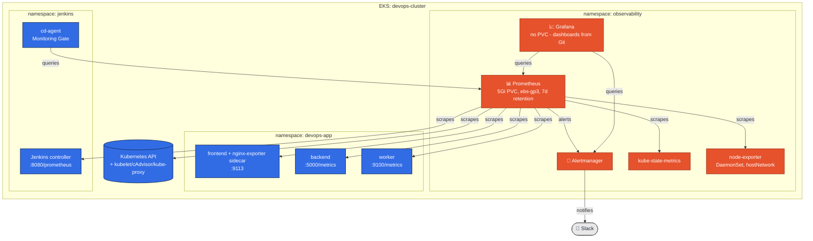

# DevOps on AWS - Jenkins CI/CD & Observability on Kubernetes (Assignments 4-5)

This project is a self-hosted **Jenkins** running inside **Kubernetes (EKS)**, building and
deploying a 3-tier app (nginx frontend, Flask backend, a background worker) through two separate
pipelines: a real Git-push-triggered **CI** pipeline that builds, tests, scans, and pushes
immutable-tagged Docker images, and a separate **CD** pipeline that deploys the exact image CI
built via `helm upgrade --install`, verifies the rollout, and smoke-tests the result. On top of
that, a **Prometheus + Grafana + Alertmanager** stack (`observability/`) instruments the app and
Jenkins itself, alerts on real failure conditions via Slack, and gates every CD deploy on the
release's actual live health, not just `Running` - see [§13](#13-observability-architecture-and-install)
onward.

The app itself, its Helm chart, and the AWS infrastructure it runs on (RDS, S3, SNS, the VPC) come
from earlier work in this rolling project - see [§12](#12-supporting-infrastructure) for how that's
built, deployed, and torn down, and [History](#19-history) for how the project got here. This
README covers Assignment 4 (Jenkins CI/CD, [§1](#1-architecture-and-environment-choice)-
[§12](#12-supporting-infrastructure)) and Assignment 5 (Observability,
[§13](#13-observability-architecture-and-install)-[§18](#18-failure-exercises-and-recovery)).

Built solo, not in a pair.

---

## Contents

1. [Architecture and environment choice](#1-architecture-and-environment-choice)
2. [Prerequisites and versions](#2-prerequisites-and-versions)
3. [Installing Jenkins from code](#3-installing-jenkins-from-code)
4. [Jenkins Configuration as Code (JCasC)](#4-jenkins-configuration-as-code-jcasc)
5. [CI Pipeline](#5-ci-pipeline-jenkinscijenkinsfile)
6. [CD Pipeline](#6-cd-pipeline-jenkinscdjenkinsfile)
7. [Jobs as code, and how CI connects to CD](#7-jobs-as-code-and-how-ci-connects-to-cd)
8. [Credentials and secrets](#8-credentials-and-secrets)
9. [Security](#9-security)
10. [Cleanup](#10-cleanup)
11. [Trade-offs](#11-trade-offs)
12. [Supporting infrastructure](#12-supporting-infrastructure)
13. [Observability architecture and install](#13-observability-architecture-and-install)
14. [Application instrumentation](#14-application-instrumentation)
15. [Alerts, SLOs, and dashboards](#15-alerts-slos-and-dashboards)
16. [CI/CD integration](#16-cicd-integration)
17. [Observability security](#17-observability-security)
18. [Failure exercises and recovery](#18-failure-exercises-and-recovery)
19. [History](#19-history)

---

## 1. Architecture and environment choice

Jenkins runs in the same `devops-cluster` EKS cluster as the app (a separate cluster was the other
option the assignment allows, but would mean a second cluster's worth of cost and a cross-cluster
credential the CD pipeline would need to manage, for no real isolation benefit at this scale - the
`jenkins` and `devops-app` namespaces already provide the separation that matters: distinct RBAC,
distinct ServiceAccounts, no shared secrets).

```
jenkins namespace                          devops-app namespace
┌─────────────────────────────┐            ┌──────────────────────────┐
│ jenkins-0 (controller)       │            │ frontend/backend/worker  │
│  - never runs builds         │            │  deployments             │
│  - PVC: jenkins home (8Gi)   │            │                          │
│ webhook-relay                │  CD agent  │                          │
│                               │  deploys → │                          │
│ ci-agent Pod (ephemeral)  ────┼── pushes ─→│ ECR (958...:us-east-1)  │
│ cd-agent Pod (ephemeral)  ────┼───────────→│                          │
└─────────────────────────────┘            └──────────────────────────┘
```

**Security boundary**: the Jenkins UI has no public IP, Ingress, or LoadBalancer - it's a plain
`ClusterIP` Service, reachable only via `kubectl port-forward` (see [§9](#9-security)).
Inbound webhook traffic never reaches Jenkins directly either: GitHub POSTs to a public
[smee.io](https://smee.io) channel, and a `webhook-relay` Deployment inside the cluster holds an
*outbound* connection to that channel and forwards matching events to Jenkins' internal
`/github-webhook/` endpoint over the in-cluster network. Jenkins ends up with zero inbound ports
open to the internet, in either direction.

**How CD authenticates to the target cluster**: since Jenkins and the app share a cluster, the CD
agent Pod authenticates via its own `cd-deploy-sa` Kubernetes ServiceAccount token (automatically
mounted, in-cluster) - no kubeconfig, no static credential, nothing to rotate. If the target were a
different cluster, this would instead need a stored kubeconfig/token as a Jenkins Credential, scoped
as narrowly as `cd-deploy-sa` is now.

---

## 2. Prerequisites and versions

| Tool | Version | Where pinned |
|---|---|---|
| EKS cluster | Kubernetes 1.34 | `setup.sh` (`eksctl create cluster`) |
| Jenkins controller image | `jenkins/jenkins:2.541.3-lts-jdk17` | `jenkins/values.yaml` |
| Jenkins Helm chart | `5.9.54` (jenkinsci/jenkins) | `jenkins/scripts/install-jenkins.sh` |
| eksctl | `v0.229.0`/`0.230.0` | `setup.sh`, `jenkins/scripts/install-jenkins.sh` |
| Helm | `v3.21.4` | client-side, any recent 3.x |
| kubectl / aws-cli | any recent version | client-side |
| Cosign | `v3.1.3` (static binary, fetched at runtime by the CI agent, sha256-verified against a checksum pinned alongside the version) | `jenkins/ci/Jenkinsfile` |
| crane (`go-containerregistry`) | `v0.21.9` (same fetch-and-verify pattern as Cosign) | `jenkins/ci/Jenkinsfile` |
| Cluster Autoscaler Helm chart | `9.59.0` (app `1.35.0`, matches this cluster's Kubernetes 1.34) | `jenkins/scripts/install-jenkins.sh` |
| kube-prometheus-stack Helm chart | `88.5.4` (prometheus-community) | `observability/scripts/install-observability.sh` |
| promtool / Prometheus | `v3.14.0` (static binary, checksum-verified) | `jenkins/ci/Jenkinsfile` |
| kubeconform | `v0.8.0` (same fetch-and-verify pattern) | `jenkins/ci/Jenkinsfile` |
| Helm (fetched, CI-only) | `v3.16.4` (matches `dtzar/helm-kubectl:3.16`, the `deploy` container's own Helm line) | `jenkins/ci/Jenkinsfile` |
| nginx-prometheus-exporter | `1.5.3` (digest-pinned) | `helm/devops-app/values.yaml` |

Also requires: an EKS cluster and `devops-app` namespace already brought up via this repo's own
`setup.sh` (Jenkins is layered on top of that infra - see [§12](#12-supporting-infrastructure) - it
doesn't create a cluster itself), and a GitHub repository with permission to add a webhook.

---

## 3. Installing Jenkins from code

Six scripts, each idempotent (safe to re-run) and each doing exactly one thing:

```bash
bash jenkins/scripts/install-jenkins.sh       # namespace, RBAC, ci-build-sa, EBS CSI driver +
                                               # StorageClass, the Jenkins Helm release + JCasC,
                                               # Cluster Autoscaler
bash jenkins/scripts/configure-jenkins.sh     # mints the smee.io channel, deploys webhook-relay,
                                               # creates the webhook + PR-token secret (admin
                                               # password and secrets go to a local temp file, not
                                               # the console - see §8)
bash jenkins/jobs/create-jobs.sh              # creates/updates all three jobs via Jenkins' REST
                                               # API (needs a port-forward - see below)
bash jenkins/scripts/verify-jenkins.sh        # read-only health check against everything above
bash jenkins/scripts/lock-plugin-versions.sh  # captures the live controller's exact resolved
                                               # plugin set - run once after a clean boot, see
                                               # jenkins/values.yaml's installPlugins comment
bash jenkins/scripts/uninstall-jenkins.sh     # removes Jenkins only - app and cluster untouched
```

`create-jobs.sh` needs Jenkins reachable at `http://localhost:8080`:

```bash
kubectl port-forward svc/jenkins -n jenkins 8080:8080 &
bash jenkins/jobs/create-jobs.sh
```

None of this is done through the Jenkins UI. `install-jenkins.sh` applies RBAC and IRSA from files
in this repo, then installs the official `jenkinsci/jenkins` Helm chart with
[JCasC](https://github.com/jenkinsci/configuration-as-code-plugin) (`jenkins/values.yaml`) driving
the plugin list, the Kubernetes cloud, and both agent pod templates - the controller comes up
already fully configured, no manual "click through setup wizard" step exists. `create-jobs.sh`
creates the two jobs from the `config.xml` files in `jenkins/jobs/` via Jenkins' own REST API - the
one alternative to a Job DSL seed job or a Multibranch Pipeline, and the one this project uses
because an earlier attempt at a JCasC-driven seed job crashed the controller's entire boot
sequence on a syntax slip (see `jenkins/values.yaml`'s own comment): a bug in job creation now
only fails `create-jobs.sh`, never brings the controller down.

**A note on Windows**: if running these scripts from Git Bash on Windows, `kubectl exec ... --
/bin/cat ...` needs `MSYS_NO_PATHCONV=1` set (already done inside the three scripts that need it) -
without it, MSYS rewrites the Unix path argument into a Windows path before it reaches the
container. No-op on Linux/Mac.

---

## 4. Jenkins Configuration as Code (JCasC)

Everything under `controller.JCasC.configScripts` in `jenkins/values.yaml` becomes live controller
configuration on boot - no manual System Config page was ever touched:

- **Kubernetes cloud** (`devops-agents`): where ephemeral agent Pods get scheduled from, pointed at
  the in-cluster API server, capped at 10 concurrent agent Pods, `podRetention: never` (agents are
  deleted immediately after their build, not kept around).
- **Agent templates**: `ci-agent` (three containers - `python` for lint/test/signing, `kaniko` for
  the image build, `trivy` for the image scan/SBOM; `serviceAccount: ci-build-sa`) and `cd-agent`
  (one `deploy` container with `kubectl`+`helm`; `serviceAccount: cd-deploy-sa`). Both templates set
  explicit `resourceRequest*`/`resourceLimit*` on every container, and every container image is
  pinned by digest (`image:tag@sha256:...`), not just tag - each digest resolved directly against
  the registry (Docker Hub / GCR manifest API) at the time it was pinned, re-pinned the same way on
  update rather than guessed. No fourth container for Cosign -
  its only official image is distroless (no shell), which breaks the idle-container-then-`exec`
  pattern every other tool here uses, so the CI pipeline fetches the static binary into the existing
  `python` container at runtime instead (§5). The same `ci-agent` template is also what each
  parallel matrix cell in §5's Build/Scan/Push+Sign stage requests a fresh Pod from - no separate
  template needed for that either.
- **Plugin list**: all 85 entries in `installPlugins` are pinned `shortName:version`, not bare names -
  the 12 actually wanted (`kubernetes`, `kubernetes-credentials-provider`, `workflow-aggregator`,
  `git`, `github`, `job-dsl`, `configuration-as-code`, `credentials-binding`, `timestamper`,
  `ws-cleanup`, `pipeline-groovy-lib`, `generic-webhook-trigger`) plus every transitive dependency,
  captured by `jenkins/scripts/lock-plugin-versions.sh` against a live controller and confirmed by
  wiping the Jenkins PVC and reinstalling from scratch on that exact pinned set. An earlier attempt
  pinned only the top-level plugins, each to whatever version plugins.jenkins.io reported
  independently - those turned out mutually incompatible (a `ClassNotFoundException`, each plugin's
  dependency graph checked in isolation rather than as a set); capturing a set that's already proven
  to boot clean together is the fix, not guessing more carefully.
- **Shared Library** (`devops-shared-lib`, bonus): a `globalLibraries` entry points
  `pipeline-groovy-lib`'s `modernSCM` retriever at this same repo (`main` branch,
  `libraryPath: jenkins/shared-library`) - one less repo to keep in sync, not a dedicated library
  repo. Four steps in `jenkins/shared-library/vars/`, all genuinely shared, not decorative:
  `trivyScan` is the identical scan-then-gate logic both `ci/Jenkinsfile`'s matrix and
  `pr-Jenkinsfile`'s quality gate call (§5); `lintCode`/`runTests` are the same Pyflakes/pytest steps
  both of those pipelines run for the same reason - a PR should be checked against exactly what a
  real push would run, not a closely-related copy of it; `notifySlack` is called from both
  `ci/Jenkinsfile` and `cd/Jenkinsfile`'s `post{}` blocks (§8).

---

## 5. CI Pipeline (`jenkins/ci/Jenkinsfile`)

Trigger: `triggers { githubPush() }`, wired to the job via `com.cloudbees.jenkins.GitHubPushTrigger`
in `jenkins/jobs/ci-application-config.xml` (the trigger has to be declared there too - `githubPush()`
alone inside the Jenkinsfile isn't enough for Jenkins to register it as a live trigger before a
first build has already run with it configured).

| Stage | What it does |
|---|---|
| Checkout | Pulls the repo, computes `IMAGE_TAG` = full commit SHA |
| Validation | Confirms every service's `Dockerfile`/`.dockerignore` and the Helm chart exist |
| Static Analysis / Lint | `pyflakes` against `backend/app.py` and `worker/worker.py` |
| Tests | `pytest` against `backend/test_app.py`, results published via `junit` |
| **Build, Scan, Push+Sign** (`matrix`) | Runs once per service (`frontend`/`backend`/`worker`), each cell on its **own freshly-provisioned `ci-agent` Pod** - genuine parallel builds, not three processes sharing one container. Each cell: **Build** (Kaniko builds to a local tarball only - `--no-push --tarPath` - no Docker socket, see [§9](#9-security)), **Scan + SBOM** (Trivy scans that local tarball, the same tarball-scanning mode `pr-Jenkinsfile`'s quality gate uses - HIGH+CRITICAL reported non-blocking and archived, fixable CRITICAL findings fail that cell's build *before anything reaches ECR* - and generates a CycloneDX SBOM, archived as `sbom-<service>.json`), **Push + Sign** (`crane` pushes the already-scanned tarball to ECR, then Cosign signs the pushed image *by digest* with the project's AWS KMS key), **Publish Metadata** (archives `image-metadata-<service>.txt`: tag, digest, signed status) |

Runs on the `ci-agent` template as `ci-build-sa` (IRSA - pushes to/pulls from ECR and signs via
AWS KMS through a real AWS IAM role, no static credential anywhere in the pipeline). Images are
tagged with the immutable full commit SHA - never `latest` - and the three ECR repos are
`IMAGE_TAG_MUTABILITY: IMMUTABLE` (`terraform/ecr.tf`), so even a mistake can't silently overwrite a
tag already in use. A failed Test/Lint/Build/Scan/Push cell fails the whole build (Declarative
Pipeline's default, including matrix cells) and never reaches the `success` post-block that triggers
CD - so a scan failure means nothing gets deployed *and* nothing ever reaches ECR in the first place,
since Kaniko no longer pushes as part of Build (see [§11](#11-trade-offs) - this used to be a
documented atomic-push trade-off; it isn't one anymore).

**Signing**: `cosign sign --key awskms:///alias/devops-app-cosign --use-signing-config=false
--tlog-upload=false --yes <image>@<digest>` - signs the immutable digest, not the mutable tag,
using an asymmetric KMS key (`terraform/kms.tf`) with no private key material anywhere, ever.
`ci-build-sa` gets exactly three KMS actions (`DevOps-CI-Cosign-Sign-Policy` in `terraform/iam.tf`):
`GetPublicKey`, `DescribeKey`, `Sign` - nothing that could delete or manage the key itself. The
`--tlog-upload=false` pair is deliberate, not a default: Cosign uploads to the public Rekor
transparency log even for KMS-based signing unless told not to, which would silently reintroduce
the exact dependency on public Sigstore infrastructure this project chose KMS signing specifically
to avoid (see [§11](#11-trade-offs)) - caught live when `cosign verify` failed against a signature
that had uploaded there anyway. The consequence: verifying needs
`cosign verify --key awskms:///alias/devops-app-cosign --insecure-ignore-tlog=true <image>@<digest>`
- the flag name sounds alarming, but "insecure" here just means "don't require a public transparency
log entry that was never created by design"; the KMS key itself (IAM-controlled, not a bare
keypair) is still the real trust anchor either way. Verification isn't wired into a CD gate - the
assignment's bonus asks for signing, not a verify-or-block deploy step, and adding one would be
scope beyond what was asked.

### PR quality gate (`jenkins/ci/pr-Jenkinsfile`, bonus)

A genuinely separate pipeline, job (`ci-application-pr`), and trigger - not a branch inside
`ci/Jenkinsfile`. Runs Validation, Lint, Tests, then builds all three services with Kaniko's
`--no-push --tarPath` (no `--destination` at all - the image never touches ECR) and scans each
tarball with the same `trivyScan()` shared-library gate `ci/Jenkinsfile` uses. No SBOM, no Cosign
signing, no trigger of `cd-application` anywhere in the file - none of those are meaningful for an
image nothing will ever deploy. This satisfies both the §11 bonus ("separate Pipeline for Pull
Requests with a quality gate") and the CI section's own note about preventing a registry push for
an unapproved PR, with one design instead of two.

**Trigger**: the `github` plugin's push trigger (`triggers { githubPush() }`, used by
`ci/Jenkinsfile`) only ever fires on push. `ci-application-pr` uses the `generic-webhook-trigger`
plugin instead, configured entirely in `jenkins/jobs/ci-application-pr-config.xml`'s `<triggers>`
block - it extracts `PR_NUMBER`, `PR_HEAD_SHA`, `PR_HEAD_REF`, and `PR_ACTION` straight from the
incoming JSON as environment variables (no separate `ParametersDefinitionProperty` needed), gated
on `pull_request` events with `action` in `opened`/`synchronize`/`reopened` - GitHub sends other
`pull_request` actions too (`closed`, `labeled`, ...) that shouldn't trigger a build.
`jenkins/webhook-relay.yaml`'s relay script routes by event type: `push`/`ping` keep going to the
`github` plugin's `/github-webhook/` endpoint exactly as before, `pull_request` goes to
`/generic-webhook-trigger/invoke?token=<generated>` instead - one relay, two destinations, based
on the same `x-github-event` header it already inspected. The token itself is generated by
`configure-jenkins.sh` (not a literal committed to this repo) and injected into
`ci-application-pr-config.xml`'s `<token>` at apply time by `create-jobs.sh` - see [§8](#8-credentials-and-secrets).
`configure-jenkins.sh` subscribes the GitHub webhook to both event types.

**Signature verification**: every delivery is HMAC-verified in the relay itself (`relay.js`, using
the same `git-webhook-secret` shared secret from [§8](#8-credentials-and-secrets)) before it's ever
forwarded to either Jenkins endpoint - not left as a manual GitHub-plugin System Config step, since
that could only ever be a documented follow-up, not something a script could apply to Jenkins' own
UI state. **Confirmed live** against real GitHub deliveries (both `push` and `pull_request` events,
via a real PR through the full quality-gate flow) - smee.io re-encoding the original payload before
this relay ever sees it was the real risk (a re-encoded body byte-for-byte diverging from what GitHub
signed the HMAC over), and it didn't happen: every real delivery verified and forwarded correctly.
`VERIFY_SIGNATURES` in `jenkins/webhook-relay.yaml` remains a one-line toggle back to
forward-everything, kept as a rollback switch rather than removed now that it's unneeded.

**Checkout**: the job's own SCM config only fetches `pr-Jenkinsfile` itself from `main` (same as the
other two jobs) - the pipeline's first stage does its own separate `checkout` with an explicit
refspec into GitHub's `refs/pull/*/head` ref namespace, at the exact `PR_HEAD_SHA` the trigger
supplied. The PR's actual head commit is the only thing this quality gate ever evaluates, regardless
of what the target branch looks like by the time the build runs.

---

## 6. CD Pipeline (`jenkins/cd/Jenkinsfile`)

Never builds an image, never touches application source - checks out only to read the Helm chart.
Takes two parameters: `IMAGE_TAG` (refuses to run without one, or with `latest`) and
`RELEASE_MANIFEST` (the `release-manifest.txt` `ci-Jenkinsfile` produces - see [§7](#7-jobs-as-code-and-how-ci-connects-to-cd)).
Deploys directly via `helm upgrade --install` - an earlier version of this project used
ArgoCD/GitOps for this instead; see [History](#13-history) for why that changed.

| Stage | What it does |
|---|---|
| Checkout | Pulls the Helm chart only |
| Input Validation | Rejects a missing/`latest` `IMAGE_TAG` or a missing `RELEASE_MANIFEST`; confirms the manifest was produced for this exact tag and that all three service digests in it are well-formed (`sha256:<64 hex>`) |
| Load infra config | Reads `dbHost`/`s3BucketName`/`snsTopicArn`/`dbPasswordSecretName` from the `terraform-outputs` ConfigMap `setup.sh` publishes in `devops-app` (these change every `terraform apply`, so they're read at deploy time, never hardcoded) |
| Manifest Validation | `helm lint --strict` + a full `helm template` render |
| Deploy | `helm upgrade --install devops-app ./helm/devops-app --set image.tag=$IMAGE_TAG ... --wait --timeout 10m` |
| Rollout | `kubectl rollout status` on all three Deployments |
| Verify | Confirms every Pod's image ends in `:$IMAGE_TAG` - fails the build if any doesn't |
| Smoke Test | Real HTTP request to `frontend-service`'s in-cluster DNS name, retried for up to 30s while Service endpoints propagate - not the public LoadBalancer (see [§9](#9-security)'s Network note on why: it's the one deliberate choice that keeps the CD agent's egress NetworkPolicy scoped to a real Pod-backed destination instead of opening port 80 to `0.0.0.0/0`) |

Runs on the `cd-agent` template as `cd-deploy-sa` - a plain (non-IRSA) ServiceAccount, since it only
ever calls the in-cluster Kubernetes API, never an AWS API directly. `RELEASE_MANIFEST`'s digest
check is deliberately format validation, not a live ECR existence check: a live check would mean
granting `cd-deploy-sa` AWS/ECR read access it has no other need for, which cuts against its own
least-privilege design here - a genuinely nonexistent image still fails safely regardless, via
`ImagePullBackOff` surfacing at the Rollout stage, which already triggers the same automated
rollback path as any other post-deploy failure.

**Traceability**: a CD build's console log shows exactly who triggered it
(`currentBuild.getBuildCauses()`), the image tag, target namespace/cluster, and the full
`RELEASE_MANIFEST` it validated - the CI build number, Git commit, and all three service digests
that produced this deployment, not just the tag. `kubectl get pods -n devops-app -o
jsonpath='{..image}'` independently confirms the deployed tag matches.

**Automated rollback**: `post { failure { ... } }` in `cd-Jenkinsfile` checks `helm history`/`helm
status` against the cluster's own recorded state - not a Groovy flag set only on a fully successful
`helm upgrade --install` - and runs `helm rollback devops-app -n devops-app --wait --timeout 5m` for
real, automatically, whenever a revision actually exists to roll back to. Checking the cluster
directly instead of trusting a success-only flag matters for one real edge case: if `--wait` itself
times out, Helm has already created the new revision server-side before its own CLI process exits
non-zero, so a flag set only after that command returns 0 would miss exactly that case and report
"nothing applied" while a bad revision sits live. `env.HELM_DEPLOY_ATTEMPTED` (set *before* the Helm
call, not after) still gates whether to even look - an earlier failure (bad `IMAGE_TAG`, a `helm
lint` error) that never reached the Deploy stage correctly reports nothing to roll back, without a
cluster round-trip. If the rollback itself fails, the build's console log still shows exactly where
it broke; there was never a scenario tested where the previous revision was itself unhealthy, since
CI's own scan gate keeps that from happening in the first place. **Confirmed live** for the paths that
matter day to day: several real CD runs correctly never trigger this block at all (deploy succeeds,
`post{success{}}` runs instead), and a real pre-Deploy failure (a `CreateContainerConfigError` on the
`cd-agent` Pod itself, caught and fixed the same day - see the agent-hardening note above) correctly
reported nothing to roll back, since `HELM_DEPLOY_ATTEMPTED` was never set. The one thing not forced
live is the specific edge case this logic exists for - a genuine `--wait` timeout with a bad revision
already sitting live - since reproducing that safely needs a multi-minute deploy that's actually going
to hang, not a quick synthetic failure.

---

## 7. Jobs as code, and how CI connects to CD

All three jobs (`ci-application`, `cd-application`, and the bonus `ci-application-pr`) are created
via `jenkins/jobs/create-jobs.sh` calling Jenkins' REST API with the `config.xml` files in that same
directory - `POST .../createItem` if the job doesn't exist yet, `POST .../config.xml` (an update) if
it does, so re-running after editing a Jenkinsfile or a `config.xml` is a normal, safe operation.
Creating any of them by hand through the Jenkins UI is explicitly out of scope for this assignment
and isn't how these ever get created here.

CI connects to CD via `build job: 'cd-application', parameters: [...], wait: false` in
`ci-Jenkinsfile`'s `post { success { ... } }` block, passing two things: `IMAGE_TAG` (the tag it just
pushed) and `RELEASE_MANIFEST` - a plain `KEY=value` text manifest (`release-manifest.txt`, also
archived as a build artifact) carrying the CI build number, Git commit, and all three services'
image digests, assembled from values each matrix cell bubbles into the shared Pipeline `env` as it
finishes (`env."DIGEST_${SERVICE}"` - `env` is Pipeline-global, not scoped to whichever agent Pod a
step happened to run on, so this survives past the matrix even though each cell ran on its own
separate Pod). `wait: false` so CI's own build finishes and frees its agent Pod immediately rather
than blocking on the entire CD run. This manifest hand-off is what lets a CD build satisfy
Traceability back to the exact CI build/commit/digests that produced it (see
[§6](#6-cd-pipeline-jenkinscdjenkinsfile)), not just the tag - and it's one of the assignment's own
listed CI→CD linkage options ("saving artifact metadata or a release manifest that CD reads
explicitly"), not a bespoke mechanism. Even though CD fires automatically, it still exists as its own
job with its own Jenkinsfile, satisfying the assignment's requirement that CI and CD stay visibly
separate pipelines.

---

## 8. Credentials and secrets

| Where a secret lives | How |
|---|---|
| ECR push (CI) | IRSA (`ci-build-sa` → `DevOps-CI-ECR-Push-Policy`) - no static credential exists |
| kubectl/helm access (CD) | `cd-deploy-sa`'s own ServiceAccount token, auto-mounted in-cluster |
| DB password | AWS Secrets Manager, read by External Secrets Operator - never touches Jenkins at all |
| GitHub webhook signature | `git-webhook-secret` Kubernetes Secret's `text` key - read directly by `webhook-relay`'s `relay.js` to HMAC-verify every delivery; also labeled `jenkins.io/credentials-type: secretText` so it's picked up automatically by the Kubernetes Credentials Provider plugin as a normal Jenkins Credential too, no JCasC edit or restart needed |
| `ci-application-pr` webhook routing token | Same Secret's `pr-token` key - generated alongside the signature secret, never a literal in git. `webhook-relay` reads it to build the endpoint URL it forwards `pull_request` events to; `create-jobs.sh` reads the same key to substitute `ci-application-pr-config.xml`'s `<token>` placeholder at apply time, so both sides stay in sync without either one committing the value |
| Slack Incoming Webhook URL (bonus) | Same mechanism, different credential: `slack-webhook-url`, created by `configure-jenkins.sh` from `$SLACK_WEBHOOK_URL` if the caller set it - optional, CI/CD work with or without it |

**Build notifications (bonus)**: `jenkins/shared-library/vars/notifySlack.groovy` posts a
pass/fail message (job, build number, a one-line summary, a link back to the build) to Slack from
both `ci/Jenkinsfile` and `cd/Jenkinsfile`'s `post{}` blocks, reading the webhook URL from the
`slack-webhook-url` credential via `withCredentials` - never inlined, never printed. Two POST
implementations picked automatically by which container the call happens to run in:
`wget --post-file` (cd-agent's Alpine-based `deploy` container, which already uses wget for the
Smoke Test) or `python3`'s `urllib.request` (ci-agent's `python` container, confirmed to have
neither curl nor wget - same constraint the Cosign binary download already worked around). The JSON
payload is written to a file first rather than embedded in any command string, and the webhook URL
is read from the process environment rather than substituted into one - avoids three-way
shell/Python/Groovy quoting collisions instead of trying to escape around them.
`pr-Jenkinsfile` doesn't notify - a quality-gate result showing on the PR's own Jenkins build page
is enough; it was never asked to page anyone.

`jenkins/secrets/credentials.example.yaml` documents the credentials this project expects to
exist and what they're for - never real values. `configure-jenkins.sh` generates the actual webhook
secret at runtime (`openssl rand -hex 20`), prints it once, and never writes it to git; the
credential is idempotent to re-run (an existing `git-webhook-secret` Secret is left alone rather
than rotated, so it never desyncs from what's actually configured on GitHub's side).

**To replace/revoke a credential**: delete the Kubernetes Secret it's backed by
(`kubectl delete secret git-webhook-secret -n jenkins`), re-run `configure-jenkins.sh` to mint a
new one, and update the webhook's secret on the GitHub side to match. No Jenkins restart needed -
the Credentials Provider plugin watches for the Secret to reappear.

Console log masking: Jenkins' `credentials-binding` plugin masks any credential value it injects via
`withCredentials` automatically (confirmed live - the Slack webhook URL prints as `****` in every
build's console). That masking only covers values that go through the plugin, though - a value
fetched some other way (like the CI Sign stage's ECR bearer token, pulled directly via `boto3`) isn't
covered by it at all. See [§9](#9-security) for the real leak this gap caused and how it was fixed.

---

## 9. Security

**RBAC**: no `cluster-admin` anywhere. `jenkins-controller` (Role, namespace-scoped to `jenkins`)
can only manage Pods/PVCs/events in its own namespace and read Secrets/ConfigMaps there - it never
gets `devops-app` access, since the controller itself never deploys anything. `cd-deploy-sa` (Role,
namespace-scoped to `devops-app`) can manage exactly the resource types Helm needs there
(Deployments, Services, ConfigMaps, Secrets, Ingresses, NetworkPolicies, HPAs, Certificates,
ExternalSecrets) - plus one unavoidable narrow `ClusterRole`, `get`-only and `resourceNames`-scoped
to exactly `devops-app`, since a namespace-scoped Role can never grant access to the (cluster-scoped)
Namespace object itself, which `helm upgrade --install` always checks for regardless of
`--create-namespace`. `ci-build-sa` needs no Kubernetes RBAC at all - Kaniko builds are pure
container-filesystem work, it never calls the Kubernetes API.

**Container/agent security**: no build ever runs on the controller (`numExecutors: 0` -
structurally impossible, not just discouraged). No agent mounts the node's Docker socket - CI
builds with Kaniko (daemonless OCI image builds), CD uses a prebuilt `kubectl`+`helm` image. Every
container in both agent templates sets explicit CPU/memory requests and limits. The webhook-relay
Pod runs as `runAsNonRoot`, `allowPrivilegeEscalation: false`, all capabilities dropped, read-only
root filesystem. The Jenkins controller itself runs under the official chart's own default
`containerSecurityContext` - `runAsUser: 1000`, `runAsGroup: 1000`, `readOnlyRootFilesystem: true`,
`allowPrivilegeEscalation: false` - never overridden to anything looser. The Jenkins controller image
is pinned to a fixed tag, never `latest`; agent container images go further and are pinned by digest
(see [§4](#4-jenkins-configuration-as-code-jcasc)).

`ci-agent`/`cd-agent`'s own containers (`jenkins/values.yaml`, applied via JCasC's raw-YAML
`yamlMergeStrategy: merge` - the structured `containers:` shorthand those templates otherwise use has
no `securityContext` field of its own) are hardened per-container, not uniformly: `python`, `trivy`,
and `deploy` run `runAsNonRoot`, `allowPrivilegeEscalation: false`, all capabilities dropped,
read-only root filesystem with an explicit writable `emptyDir` at `/tmp` (`HOME`/`TRIVY_CACHE_DIR`
pointed at it, since none of pip's user-install fallback, Trivy's vulnerability-DB cache, or
Helm/kubectl's own config/cache resolve anything sane under an arbitrary non-root UID with no
`/etc/passwd` entry). `kaniko` deliberately stays on `allowPrivilegeEscalation: false` +
`seccompProfile: RuntimeDefault` only - it has to `chown`/`chmod` extracted layer files to match
Dockerfile/base-image ownership while unpacking, which needs root or `CAP_CHOWN`/`CAP_FOWNER`
(Kaniko's own documented constraint, not an oversight - see that container's comment in
`jenkins/values.yaml`), so `runAsNonRoot` and a full capability drop would break real builds.
**Confirmed live**, including two real bugs this hardening pass only surfaced under an actual build:
`python` needed the same `HOME=/tmp` override as `deploy` (missed initially since only `trivy`'s cache
path was an obvious guess-under-arbitrary-UID case; `pip install`'s user-install fallback hit the same
problem, failing with `Read-only file system: '/.local'`), and `cd-agent`'s Pod-level
`securityContext.runAsNonRoot: true` broke its own `jnlp` sidecar (`jenkins/inbound-agent`'s image
declares `USER jenkins` - a name, not a numeric UID, which the kubelet can't statically verify as
non-root - `CreateContainerConfigError`). Fixed by moving `runAsNonRoot` off the Pod level onto just
the `deploy` container, matching `ci-agent`'s own per-container pattern (which never set it Pod-wide
for exactly this reason).

**Scanning Jenkins' own images**: separate from CI's scan of the *app* images (§5), the 5 images
Jenkins itself is built from - the controller (`jenkins/jenkins:2.541.3-lts-jdk17`) and every
agent-template container (`python:3.11-slim`, the Kaniko executor, `dtzar/helm-kubectl`, Trivy
itself) - were scanned once locally with the same tool and severity filter CI uses
(`trivy image --severity HIGH,CRITICAL`), rather than adding a pipeline stage that would re-scan
the same static, rarely-changing pin on every single build. Results and the exact command are in
`evidence/05-jenkins-image-scans/`. Findings: 4 CRITICAL (python:3.11-slim), 2 CRITICAL (Kaniko), 3
CRITICAL (helm-kubectl), 0 (Trivy), 22 CRITICAL (Jenkins controller). None of these gate the build
the way the app image scan does - these are third-party maintained images this project doesn't
patch directly, so "pinned and scanned, findings tracked" is the realistic bar, not "zero CVEs in
someone else's image."

**Network**: Jenkins UI is `ClusterIP` only - not exposed publicly, reachable only via
`kubectl port-forward svc/jenkins -n jenkins 8080:8080`. Inbound webhook traffic never reaches
Jenkins directly (see [§1](#1-architecture-and-environment-choice)'s relay explanation).
`NetworkPolicy` objects for the `jenkins` namespace (`jenkins/networkpolicies.yaml`, applied by
`install-jenkins.sh`) start from default-deny and add back exactly what each workload needs:
controller accepts ingress only from agent Pods (JNLP, port `50000`) and `webhook-relay` (port
`8080`), and its egress is the in-cluster Kubernetes API, DNS, and GitHub - not ECR/KMS/PyPI, those
stay agent-only. GitHub on the controller was a real finding, not an assumption: a Pipeline-from-SCM
job makes the *controller itself* do a lightweight `git fetch` to read the Jenkinsfile before it
ever provisions an agent Pod, so the first real build here failed until that egress was added (and a
second, separate bug in the same rule - scoping the Kubernetes API to the VPC's CIDR instead of the
cluster's actual Service CIDR - blocked the controller's own Pod-watch connection the same way).
`webhook-relay` and both agent templates accept no ingress from anywhere. The one honest limitation:
plain L3/L4 NetworkPolicy can't scope internet-bound HTTPS (GitHub, ECR, KMS, PyPI, smee.io - this
cluster has no VPC endpoints for any of them, see [§12](#12-supporting-infrastructure)) by
destination IP, only by port, so port `443` egress is necessarily broad. Port `80` isn't: it has
exactly one real destination in this whole pipeline (`cd-agent`'s Smoke Test against
`frontend-service`), so it's scoped to this cluster's Service CIDR rather than a `podSelector` on the
frontend Pods - AWS VPC CNI's NetworkPolicy agent matches egress against the pre-DNAT Service
ClusterIP, not the real Pod IP a `podSelector` resolves to, so a Pod-scoped rule here silently never
enforces at all (confirmed live three ways - see `jenkins/networkpolicies.yaml`'s own header comment
and `evidence/06-bonus-features/09-networkpolicy-live-enforcement-proof.txt` for the full trail).
What the policy still meaningfully enforces: zero lateral movement between pods in the namespace, and
zero unsolicited ingress to anything.

**Endpoints this setup actually talks to**: GitHub (`github.com`, checkout + webhook delivery via
smee.io), ECR (`*.dkr.ecr.us-east-1.amazonaws.com`, image push/pull), the in-cluster Kubernetes API
server (`kubernetes.default.svc`), and AWS Secrets Manager (via External Secrets Operator, not
Jenkins directly).

**Console logs, not just Secrets**: Jenkins' `sh` step echoes every command it runs to the build
console by default - harmless for most of this pipeline, but a real finding for the CI Sign stage
(`jenkins/ci/Jenkinsfile`), which fetches a short-lived ECR bearer token via `boto3` and passes it to
`cosign sign --registry-password`. Confirmed live in this project's own captured build logs: both the
token assignment and the full `cosign` command line (token included) printed in plaintext. Fixed with
a `set +x` before that token is ever touched - the same "never printed to a log" bar the Slack webhook
URL (masked via `withCredentials`) and the DB password (never written to disk at all) are already
held to. The token itself is 12-hour-lived and scoped only to this account's ECR, not full AWS access,
but a real credential in a build log is a real credential in a build log regardless of blast radius.
The same bar applies outside pipeline logs too: `configure-jenkins.sh` used to print the Jenkins
admin password and the freshly generated webhook secret straight to the operator's terminal (and
therefore into any saved transcript of that terminal) - both now go to a local temp file the operator
copies from and deletes instead, never echoed to the console.

---

## 10. Cleanup

`jenkins/scripts/uninstall-jenkins.sh` removes Jenkins, its PVC, RBAC, the webhook relay, and
`ci-build-sa` - leaving `devops-app` and the cluster itself running.
`observability/scripts/uninstall-observability.sh` does the same for the observability stack -
removes the Helm release, its PVC, and its NetworkPolicies, leaving `jenkins`/`devops-app`
untouched. For tearing down everything (cluster, RDS, Jenkins, observability, all of it),
`teardown.sh` already includes the namespace-specific steps both assignments added (deleting the
Jenkins and Prometheus PVCs/EBS volumes and `ci-build-sa`'s IRSA stack before the cluster
disappears - see `teardown.sh`'s own step comments for why order matters here, and
[§12](#12-supporting-infrastructure) for the full teardown flow).

**JCasC-first recovery (bonus)**: this project's whole premise is that Jenkins' *configuration*
(clouds, agent templates, plugins, RBAC, jobs) lives entirely in code, never in what's sitting on
the Jenkins home PVC - which makes "what if that PVC is gone" a claim worth actually testing, not
just asserting. The drill, run live: `kubectl delete statefulset jenkins -n jenkins` followed by
`kubectl delete pvc jenkins -n jenkins` (StatefulSet-owned PVCs aren't garbage-collected with the
StatefulSet by default, so both need deleting explicitly), then re-run `install-jenkins.sh`
(idempotent, already proven throughout this project) and `create-jobs.sh` with no other manual
step. A brand-new PVC gets dynamically provisioned; JCasC reasserts the entire controller
configuration onto it; jobs reappear from the `config.xml` files already in Git as fresh creates,
not updates. Both `git-webhook-secret` and `slack-webhook-url` survive untouched, since they're
separate Kubernetes Secrets that never lived on Jenkins' own PVC in the first place - a real
webhook-triggered build succeeds again with zero manual intervention beyond the two scripts.
Evidence, including a real capacity problem the drill surfaced along the way, in
`evidence/06-bonus-features/15-jcasc-recovery-drill-proof.txt`.

---

## 11. Trade-offs

| Decision | Why | Trade-off |
|---|---|---|
| Jenkins in the same cluster as the app | No second cluster's cost, no cross-cluster credential for CD to manage | Less blast-radius isolation than a fully separate Jenkins cluster |
| Job creation via REST API script, not Job DSL seed job or Multibranch Pipeline | A JCasC-driven seed job crashed the whole controller boot on a syntax slip - a bug here now only fails one script | An extra manual step (`create-jobs.sh`) instead of jobs appearing automatically on controller boot |
| Automated rollback only after a Helm revision actually exists | An earlier-stage failure (bad `IMAGE_TAG`, a lint error) never touched the cluster - rolling back would target a revision nothing was wrong with | An extra `helm status`/`helm history` round-trip to the cluster in the failure path, instead of trusting a flag alone - needed because `--wait` can time out (Helm CLI exits non-zero) after Helm already created the revision server-side, which a flag set only on success would miss |
| Cosign signs with an AWS KMS key (`awskms://`), not keyless/Sigstore | Matches this project's IRSA-everywhere pattern (`ci-build-sa` just gets one more narrow IAM action) instead of adding a new external dependency (the public Sigstore Fulcio/Rekor infrastructure) this project doesn't otherwise talk to | Verification needs the same AWS account/key reference, not a portable, identity-based verification anyone can run against a public transparency log |
| SBOM/sign/scan run per-service in a `matrix`, each cell its own Pod | Real parallelism (separate CPU/memory per service) instead of three processes contending inside one shared container | Up to 3 extra `ci-agent` Pods scheduled at once (on top of the pipeline's own top-level Pod) - more momentary cluster resource pressure during that stage |
| Custom webhook relay instead of the official `smee-client` npm package | `smee-client` (all versions checked) has a real upstream bug reusing an incoming header value on its own outgoing request - reproduced only with real GitHub traffic, not synthetic test POSTs | ~100 lines of relay code to maintain instead of a dependency |
| `webhook_content_type: json` via a raw API request, not `gh api`'s `-f config[key]=value` flags | `gh api -f config[content_type]=json` silently failed to nest into GitHub's webhook config - GitHub defaulted to form-encoding instead, which broke the Jenkins GitHub plugin's payload parser (`GHEventPayload$Push.getRepository()` returned null) until this was caught via a captured raw payload and the hook was recreated with an explicit JSON body | One more thing to get right if this hook is ever recreated by hand |
| Trivy scans a local Kaniko tarball (`--no-push --tarPath`) before anything reaches ECR, then `crane` pushes only what already passed - not Kaniko's atomic `--destination` push. Originally this project accepted the atomic-push trade-off (a scan failure left an unscanned, never-deployed image sitting in ECR); building to a tarball first, the same mode `pr-Jenkinsfile`'s quality gate already used, closes that instead of just tolerating it. | `crane` (`go-containerregistry`) is a fourth static binary fetched at runtime, checksum-verified the same way as Cosign - a scan-then-push flow needs *something* that can push a pre-built tarball without Kaniko rebuilding it | One more tool to keep pinned/checksummed, and one more ECR auth round-trip per service (shared with Cosign's own token fetch in the same stage, not duplicated). **Confirmed live**, and only after a real bug: Kaniko's `--digest-file` digest (predicted before the push ever happens) turned out to genuinely differ from the digest `crane` actually wrote to ECR - a real manifest-serialization difference between Kaniko's tarball output and crane's push, not a fluke. Cosign signing Kaniko's predicted digest 404'd. Fixed by dropping `--digest-file` entirely and capturing `crane push`'s own reported digest instead - the only value guaranteed to match what's actually in the registry |
| Jenkins CD (`helm upgrade --install`) instead of ArgoCD/GitOps | A real CI/CD pipeline needs to own deploy directly - GitOps auto-sync would revert every Jenkins deploy as drift (see [History](#13-history)) | Deploy history lives in Helm release revisions, not a GitOps `Application`'s sync history |
| `t3.medium` nodes instead of `t3.small` | Jenkins (a resident controller Pod, a resident webhook-relay Pod, and bursts of ephemeral CI/CD agent Pods) on top of an already-tight `t3.small` cluster (11 pods/node) risked agent Pods stuck `Pending` mid-build; `t3.medium` doubles memory per node and raises the ceiling to 17/node for the same node count | Roughly doubles hourly node cost |
| Cluster Autoscaler on top of the fixed 3-node baseline (min 3, max 6) | The fixed baseline alone genuinely wasn't enough: confirmed live when two full CI matrix builds landed at once (two real pushes a few seconds apart), several matrix cells sat `Pending`/`Insufficient cpu,memory` for roughly a minute before earlier stages finished and freed capacity on their own - resolved without it, but only because nothing was actually stuck. Re-triggered the identical scenario after installing Cluster Autoscaler and it scaled the ASG `3->4` within seconds of the first unschedulable Pod, confirmed live down to the ASG's own `DesiredCapacity` changing | A fourth IAM policy (`DevOps-ClusterAutoscaler-Policy`, tag-conditioned to this cluster's own ASG - see `terraform/iam.tf`'s own comment on why the mutating actions can't be ARN-scoped the way `eks:DescribeNodegroup` is) and one more cluster-level Helm release (`kube-system`, alongside cert-manager/Fluent Bit/EBS CSI) - and the cluster can now scale itself past the fixed baseline under real load, not just at a cost ceiling fixed at setup time |
| `generic-webhook-trigger` for `ci-application-pr`, not Multibranch Pipeline or GHPRB | Multibranch would mean a second, structurally different job type (and PR discovery/scanning machinery) alongside the two REST-API-created Pipeline jobs; GHPRB needs a bot GitHub account. A JSON-field-extraction trigger keeps the third job created exactly the same way as the first two | Live-verified, but only after a real bug: the first version's header-based event-type filter never actually matched GitHub's real header name, so the webhook returned 200 while silently never queuing a build - root-caused and simplified (see `evidence/06-bonus-features/13a-pr-quality-gate-trigger-bug-and-fix.txt`), not something a config.xml export alone would have caught |
| Notifications via Slack Incoming Webhook, not the existing SNS topic | Zero AWS/Terraform changes - `cd-deploy-sa` stays a plain, non-IRSA ServiceAccount exactly as designed; both agent containers can already POST JSON without installing anything new | A second external credential to manage (`slack-webhook-url`) instead of reusing infrastructure that already existed |
| Shared Library lives in this same repo (`jenkins/shared-library/`), not a dedicated library repo | One less repository to keep in sync, one less place a version mismatch could hide | `libraryPath` (pointing the retriever at a subdirectory instead of a repo root) is a less common configuration than the plugin's default - confirmed live against `pipeline-groovy-lib` 798.v5cc688825312, no fallback needed |
| Frontend's metrics endpoint on a second, `ClusterIP`-only Service instead of a third port on `frontend-service` | `frontend-service` is `type: LoadBalancer` - every port listed there becomes its own public ELB listener, which would put the metrics port on the internet right alongside `:80`/`:443` | One more Service object and one more `ServiceMonitor` to keep in sync with the frontend Pod's own label selector, instead of a single Service covering both concerns |
| Grafana with no persistence, everything from Git via the sidecar-ConfigMap mechanism | Every dashboard/datasource is already defined as code - a PVC would just be a second source of truth that can drift from it | A Pod restart loses anything a person changed by hand directly in the Grafana UI (starring a dashboard, an ad-hoc panel edit) - acceptable here since nothing is meant to be configured by hand in the first place |
| `wget`/`grep`/`awk` for the CD Monitoring Gate's Prometheus queries, not `jq`/`python3` | The `deploy` container (`dtzar/helm-kubectl`) has neither installed, and adding one more tool just for two read-only queries didn't seem worth a new dependency on a container this project otherwise keeps minimal | More fragile JSON parsing than a real JSON library - mitigated by testing the exact response shape live rather than assuming it, and by an explicit "no data" check before ever trusting an extracted value (see [§16](#16-cicd-integration)) |

---

## 12. Supporting infrastructure

Jenkins CD deploys the app onto infrastructure that's brought up separately, ahead of time, by this
repo's own `setup.sh` - not something Jenkins creates itself. This section is the condensed
reference for that supporting layer: what it is, how to bring it up and tear it down, and how it's
secured.

**Architecture.** A 3-tier app - nginx frontend, Flask backend, a background worker - on EKS,
backed by managed AWS services (RDS PostgreSQL, S3, SNS) provisioned with Terraform.


* **Frontend** (`frontend-deployment` / `frontend-service`) - nginx. Serves the static UI and
  reverse-proxies `/api/*` to the backend. The only component exposed outside the cluster
  (`type: LoadBalancer`, both HTTP and self-signed HTTPS).
* **Backend** (`backend-deployment` / `backend-service`) - Flask + Gunicorn. Reads/writes RDS,
  uploads to S3, publishes to SNS. `ClusterIP` only, never reachable directly from the internet.
* **Worker** (`worker-deployment`) - polls the `items` table every `POLL_INTERVAL_SECONDS`
  (30s by default), marks pending rows as done, and sends an SNS summary. No Service object and no
  inbound NetworkPolicy access at all - it only ever makes outbound calls.

We use RDS instead of running PostgreSQL as a pod because a managed database with real backups
doesn't tie the data's lifetime to the cluster's.

**Building images.** Each service has its own pinned, non-root, `.dockerignore`'d `Dockerfile`
(`frontend/`, `backend/`, `worker/`). `setup.sh` builds, Trivy-scans (if installed, non-blocking,
purely for local visibility), tags (`v1.0.0`, never `latest`), and pushes all three to ECR as part
of infra bring-up. Worker nodes pull from ECR using the node's own IAM role, so no
`imagePullSecrets` are needed anywhere.

**The Helm chart.** The Kubernetes side lives entirely under `helm/devops-app/` - one chart, one
release, no raw manifests applied by hand. Templates cover `ConfigMap`, `SecretStore`,
`ExternalSecret`, `Certificate`, `ServiceAccount`, `Deployment` x3, `Service` x2, `NetworkPolicy`
x3, `PodDisruptionBudget` x2, `HorizontalPodAutoscaler` x2. There's deliberately no `Secret`
template (External Secrets Operator creates `app-secrets` itself, reading the real password
straight from AWS Secrets Manager - the value never passes through this chart, Helm, or this repo
at any point) and no `Namespace` template (`setup.sh` creates `devops-app` directly; a chart-owned
Namespace conflicts with Jenkins CD's deliberately narrow, namespace-scoped RBAC - see
[§9](#9-security)). `helm/values-dynamic.example.yaml` shows the shape of the real
infrastructure values (RDS endpoint, S3 bucket, SNS topic, the Secrets Manager secret *name*) that
Jenkins CD supplies at deploy time from a ConfigMap, for anyone who wants to `helm upgrade` by hand
instead.

**Deploying and tearing down.**

```bash
make k8s-deploy       # runs setup.sh - infra bring-up only, does NOT deploy the app (Jenkins CD does)
make k8s-teardown     # runs teardown.sh - removes everything: cluster, RDS, Jenkins, all of it
make verify-teardown  # runs verify-teardown.sh - read-only, confirms nothing billable was left behind
```

`setup.sh` is fully automated end to end: pre-flight checks → one DB password prompt (kept in
memory only, never written to disk) → `terraform apply` (RDS, S3, SNS, ECR, IAM, VPC) → create/reuse
the EKS cluster inside that same VPC (no VPC peering needed) → enable VPC CNI NetworkPolicy
enforcement (off by default on EKS) → open the RDS security group to the cluster's → IRSA for
`backend-sa`/`worker-sa` → External Secrets Operator → cert-manager (self-signed `ClusterIssuer`)
→ Fluent Bit (CloudWatch logs) → build/scan/push the three images → publish the `terraform-outputs`
ConfigMap Jenkins CD reads from. It deliberately stops there - the app's first deployment is
`cd-application`'s job (see [§6](#6-cd-pipeline-jenkinscdjenkinsfile)), not this script's. Takes
roughly 20-30 minutes on a first run, almost all of it waiting for the EKS cluster to boot; safe to
re-run since every step checks whether its target already exists first.

`teardown.sh` reverses this in an order that matters (load balancer released before the cluster
dies, the RDS security-group rule revoked before EKS cleans up its own, the Jenkins PVC's EBS
volume deleted before the EBS CSI driver disappears with the cluster, IRSA IAM roles deleted before
`terraform destroy`). `verify-teardown.sh` is a separate, read-only script that checks every
category of resource that either bills continuously, that `teardown.sh` has previously been found
to miss, or that could silently block a clean re-run later even without costing anything (a stuck
eksctl CloudFormation stack) - `teardown.sh` prints the exact command to run it as its last line, so
this isn't a step you have to already know to look for. `make destroy` (bare `terraform destroy`,
no EKS/Jenkins-aware ordering) deliberately refuses to run at all while the EKS cluster still
exists, rather than failing halfway through or silently orphaning a load balancer - `make
k8s-teardown` is the only supported way to tear down once the cluster is up.

**Sanity checks once deployed:**

```bash
kubectl get pods,deployments,services -n devops-app
kubectl get pods -n devops-app -o jsonpath='{..image}'
```

Open the URL `setup.sh` prints (self-signed HTTPS - the browser warning is expected); creating an
item in the UI calls the backend, which writes to RDS and publishes to SNS; uploading a file writes
to S3. A `kubectl delete pod <backend-pod> -n devops-app` should self-heal without downtime (2
frontend/backend replicas, a readiness probe gating traffic during the restart).

**Security.**

* *ServiceAccounts and IRSA.* `frontend-sa` has no AWS access at all. `backend-sa` and `worker-sa`
  each get their own IAM role via IRSA with **separate**, workload-scoped policies - `backend-sa`
  gets S3 + SNS, `worker-sa` gets SNS only, since `worker.py` never touches S3. `fluent-bit-sa` and
  `external-secrets-sa` are scoped to exactly one thing each too (one log group, one Secrets
  Manager secret). No workload has any Kubernetes RBAC beyond the defaults.
* *Secrets.* The only Kubernetes `Secret` is `DB_PASSWORD`, and nothing creates it directly -
  External Secrets Operator reads the real value from AWS Secrets Manager and writes `app-secrets`
  itself, on a 1-hour refresh. `helm/devops-app/secret.example.yaml` documents the resulting shape.
  AWS credentials never touch a Kubernetes Secret anywhere in this project - IRSA replaces them
  everywhere.
* *Network policies.* Enforced, not just defined - EKS ships VPC CNI policy enforcement **disabled**
  by default, so `setup.sh` explicitly turns it on before anything else deploys. Frontend accepts
  ingress from anywhere but egress only to backend+DNS; backend accepts ingress only from pods
  labeled `app: frontend`; worker denies all ingress. RDS is protected at the AWS layer instead -
  its security group only allows `5432` from the EKS cluster's own security group, never
  `0.0.0.0/0`.
* *Containers.* Every container: `runAsNonRoot`, `allowPrivilegeEscalation: false`,
  `readOnlyRootFilesystem: true`, all capabilities dropped, explicit writable `emptyDir`s wherever
  something needs to write at runtime. The frontend's non-root behavior holds even under a bare
  `docker run`, not just under a Kubernetes override, since its image
  (`nginxinc/nginx-unprivileged`) is non-root and listens on unprivileged ports by default.
* *AWS resources.* RDS and SNS encrypted at rest with AWS-managed KMS keys; S3 has SSE-S3
  encryption and a full public access block. Checked automatically by `trivy config` in CI.
* *Ingress/TLS.* A plain `Service` of `type: LoadBalancer`, not a Kubernetes `Ingress` - only one
  public route, so an ingress controller would be overhead without benefit. HTTPS via
  **cert-manager** against a self-signed `ClusterIssuer` (browsers show a "not trusted" warning
  since there's no real domain, but the issuance/renewal mechanism is the same one a real
  ACME/Let's Encrypt setup would use).

**Reliability.** Readiness/liveness probes on all three Deployments (backend's *readiness* probe
opens a real RDS connection so a DB outage pulls it from rotation; its *liveness* probe checks only
"is Flask still serving," so a transient RDS blip doesn't get a healthy pod killed). frontend/backend
get a `HorizontalPodAutoscaler` (2-4 replicas, CPU-based) and a `PodDisruptionBudget`
(`minAvailable: 1`); the worker gets neither (single background poller, and a PDB of 1 on a single
replica would block node drains entirely). Jenkins CD's own Verify stage (§6) is what actually
catches a bad deploy now - an earlier ArgoCD-based version of this project used `selfHeal`/`prune`
for the same purpose (see [History](#13-history)).

**Logging.** Container logs (all three services) ship to CloudWatch Logs via Fluent Bit
(`amazon-cloudwatch` namespace, IRSA-scoped to exactly this project's one log group). The log group
itself is Terraform-managed (`terraform/logging.tf`, 7-day retention), not auto-created by Fluent
Bit, so its lifecycle is tied to `terraform destroy` like everything else. One shared log group for
all three services - basic, but what the assignment actually asks for.

**EKS/RDS network connectivity.** `eksctl create cluster` would normally build its own new VPC,
separate from Terraform's - `setup.sh` instead reads the VPC/subnet IDs Terraform already created
and passes them straight to `eksctl`, so the cluster lands inside the exact same VPC RDS lives in
(no peering needed). After the cluster exists, `setup.sh` opens RDS's security group to the
cluster's - `terraform/security.tf` marks that rule `ignore_changes` so a later `terraform apply`
doesn't wipe it out. `--node-private-networking` keeps every node in the private subnets with no
public IP at all; the NAT Gateway still gives them outbound access for pulling images.

**Repository layout.**

```
setup.sh, teardown.sh, verify-teardown.sh   Infra bring-up / full teardown / clean-teardown check
output.sh                  Shared step()/info()/success()/fail()/ok()/bad() console-output helpers,
                           sourced by the three scripts above and every jenkins/scripts/*.sh
Makefile                   make k8s-deploy / make k8s-teardown / raw terraform targets
.github/workflows/ci.yml   terraform validate + helm lint + Trivy on every push/PR
.trivyignore               Accepted-risk CVE allowlist for image scanning (empty - nothing needed yet)
.gitattributes             Normalizes line endings to LF - shell script shebangs break under CRLF
terraform/                 RDS, S3, SNS, ECR, Secrets Manager, CloudWatch log group, IAM policies,
                           VPC/subnets - no compute
helm/devops-app/           The Kubernetes side: one Helm chart, deployed by Jenkins CD (§6)
helm/values-dynamic.example.yaml   Template for deploying the chart by hand, bypassing Jenkins
frontend/                  nginx (unprivileged), static UI, reverse proxy to backend
backend/                   Flask + Gunicorn API (RDS, S3, SNS)
worker/                    Background poller (RDS, SNS)
jenkins/                   Jenkins install/config scripts, CI+CD+PR Jenkinsfiles, the Shared
                           Library (shared-library/), JCasC values, RBAC, job configs,
                           architecture diagrams
observability/             Prometheus/Grafana/Alertmanager Helm values, alert + SLO recording
                           rules, dashboards, runbooks, NetworkPolicies, install/verify/uninstall
                           scripts (§13-§18)
evidence/                  Captured proof for every item on the assignment's evidence checklist:
                           Jenkins-on-Kubernetes state, CI pipeline (including a deliberately-failed
                           run that never triggers CD), CD pipeline (rollout/traceability/smoke
                           test/maxSurge:0 live capture), rollback, the Jenkins-image scans, and
                           (06-bonus-features/) all nine applicable bonus items - parallel matrix
                           builds, SBOM, Cosign signing, automated rollback, NetworkPolicies, the
                           Shared Library, the PR quality gate, Slack notifications, and
                           JCasC-first recovery. (07-review-remediation/) real evidence for an
                           external review's remediation: full-SHA tags, the scan-before-push
                           reorder (plus a real digest-mismatch bug it surfaced), Cluster
                           Autoscaler, the full plugin lock, and a real PR/webhook trigger.
                           (08-observability/) the four required failure exercises plus the
                           PVC/Pod recovery drill, all live-captured
```

`.github/workflows/ci.yml` runs `terraform fmt`/`validate`, `helm lint` plus a full `helm template`
render, builds + Trivy-scans all three images (twice - a non-blocking full report, and a blocking
gate on fixable `CRITICAL` findings), and runs `trivy config` against `terraform/` and
`helm/devops-app/` - on every push and pull request to `main`. Validation only, deliberately: this
repo is public, and wiring real AWS credentials into Actions secrets so every push could touch live
infrastructure is a different risk profile than read-only checks.

---

## 13. Observability architecture and install

Assignment 5 layers Prometheus + Grafana + Alertmanager on top of the existing `jenkins` and
`devops-app` namespaces, additively - nothing here rebuilds the app, its images, or the CI/CD
pipelines from Assignments 3/4. Everything lives under `observability/`, installed the same way
Jenkins is: a script that's safe to re-run, not a manual `kubectl apply` sequence.



**Why `kube-prometheus-stack`, not a hand-rolled stack.** One Helm release
(`prometheus-community/kube-prometheus-stack`, pinned `88.5.4`) brings Prometheus Operator,
Prometheus, Alertmanager, Grafana, kube-state-metrics, and node-exporter together with a proven,
consistent CRD-based configuration surface (`ServiceMonitor`/`PodMonitor`/`PrometheusRule`) -
building each of those from scratch would mean re-solving problems (service discovery, rule
reloading, dashboard provisioning) this chart already solves correctly.

**The one selector gotcha, fixed before it could bite.** The chart's own defaults for
`serviceMonitorSelectorNilUsesHelmValues`/`podMonitorSelectorNilUsesHelmValues`/
`ruleSelectorNilUsesHelmValues` are all `true` - "only discover ServiceMonitors/PodMonitors/
PrometheusRules carrying this Helm release's own label." Since every ServiceMonitor and
PrometheusRule this project defines lives in a *different* release (`helm/devops-app`'s chart,
`jenkins/servicemonitor.yaml`, `observability/rules/*.yaml`, none label-matched to the
`observability` release itself), that default would have silently discovered nothing outside the
chart's own bundled rules. `observability/values.yaml` sets all three to `false` up front - the
exact same class of gotcha this project already hit once for real with Jenkins' own Kubernetes
cloud config (see [§4](#4-jenkins-configuration-as-code-jcasc)), fixed here before it could
reproduce rather than after.

**Install / verify / uninstall**, same pattern as the Jenkins scripts:

| Script | What it does |
|---|---|
| `observability/scripts/install-observability.sh` | Namespace, Grafana admin credentials (generated, never committed), the Slack webhook Secret (real value or a placeholder - Alertmanager's Pod needs the Secret to exist either way), the Helm release, alert/recording rules, dashboards (loaded as plain ConfigMaps, never a manual Grafana import), NetworkPolicies. |
| `observability/scripts/verify-observability.sh` | Read-only health check - Pods, PVC, targets, alert rule groups. |
| `observability/scripts/uninstall-observability.sh` | Removes the release, PVC, NetworkPolicies - leaves `jenkins`/`devops-app` untouched. |

Install this **after** `jenkins/scripts/install-jenkins.sh` and **before** the next
`helm upgrade` of `helm/devops-app` or a fresh `jenkins/scripts/install-jenkins.sh` run: both of
those charts now declare `ServiceMonitor` resources, and `helm upgrade`/`kubectl apply` on a
`ServiceMonitor` before this chart's CRDs exist fails outright (`no matches for kind
ServiceMonitor`). `install-jenkins.sh` accounts for this itself - its ServiceMonitor step checks
for the CRD first and skips (not fails) if it isn't there yet.

Access is `kubectl port-forward` only, same posture as Jenkins - see [§17](#17-observability-security).

---

## 14. Application instrumentation

Every service gets a `/metrics` (or equivalent) endpoint and a matching `ServiceMonitor`
(`helm/devops-app/templates/servicemonitors.yaml`, `jenkins/servicemonitor.yaml`) - nothing here is
manually registered in Prometheus.

**Backend** (`backend/app.py`, `prometheus_client`) - manual `before_request`/`after_request`
hooks, not `prometheus_flask_exporter`, for full control over label cardinality:

* `http_requests_total{method,path,status}` (Counter) - `path` is the Flask *route template*
  (`request.url_rule.rule`, e.g. `/api/items`), never a raw URL or an ID - unbounded label
  cardinality from real traffic is a real Prometheus failure mode, not a hypothetical one.
* `http_request_duration_seconds{method,path}` (Histogram).
* `app_info{version,git_sha,release}` (Gauge, always `1`) - `RELEASE_VERSION` is the exact full
  commit SHA `cd/Jenkinsfile`'s `IMAGE_TAG` deployed, passed through as a new
  `config.releaseVersion` Helm value into the ConfigMap (the same env var backend/worker both
  read) - so `app_info` reports the literal deployed commit, not a guess.
* `items_created_total` (Counter) - the required business metric, incremented in `POST /api/items`.
* `/metrics`, `/healthz`, and `/api/health` are excluded from `http_requests_total` - health-check
  noise doesn't belong in a request-rate/error-rate metric.
* `POST /api/debug/fail` - unconditionally `abort(500)`. The one deliberate business-logic addition
  in this entire assignment; every other observability feature is infrastructure/config. Exists
  purely to make the `HighErrorRate` failure exercise real (see [§18](#18-failure-exercises-and-recovery)) -
  scaling the backend to 0 was the obvious-sounding alternative, but that kills the very process
  that owns the counter the alert reads, so nothing would ever record the failures.

**Worker** (`worker/worker.py`) - `prometheus_client.start_http_server(9100)`, its first-ever open
port: `worker_items_processed_total`, `worker_poll_duration_seconds`, `worker_poll_errors_total`,
`worker_last_poll_timestamp_seconds`, `app_info`.

**Frontend** - nginx's `stub_status` on a `127.0.0.1:8081`-only server block
(`frontend/nginx.k8s.conf`), scraped by an `nginx-prometheus-exporter` sidecar
(`nginx/nginx-prometheus-exporter:1.5.3`, digest-pinned same as every third-party image in this
project) that re-exposes it in Prometheus format on `:9113`. That sidecar's own metrics Service is
deliberately **not** a port on `frontend-service` - `frontend-service` is `type: LoadBalancer`, and
every port listed on a `LoadBalancer` Service becomes its own public ELB listener, which would put
`:9113` on the internet right alongside `:80`/`:443`. `frontend-metrics-service` is a second,
`ClusterIP`-only Service instead, selecting the same Pods.

`stub_status` only reports connection-level stats (active/accepted/handled connections), never
HTTP status codes - it structurally cannot see a 5xx response. `HighErrorRate` is deliberately
backed by the *backend's* own `http_requests_total{status}`, not anything nginx-side, for exactly
that reason. A related, accepted gap: if nginx can't reach the backend at all (a full outage, not
an app-level error), the backend's own counter never sees those requests either, since they never
arrive - `up{job="backend-service"}==0` (`PrometheusTargetDown`) is the actual safety net for that
specific failure mode, not a coincidence.

---

## 15. Alerts, SLOs, and dashboards

Six alerts (`observability/rules/*.yaml`) - two application, two Kubernetes, one Jenkins, one
monitoring self-check:

| Alert | Condition | `for` | Severity |
|---|---|---|---|
| `HighErrorRate` | Backend 5xx rate > 5% (`rate(http_requests_total{status=~"5.."}[5m])`) | 2m | critical |
| `HighLatencyP95` | Backend p95 request duration > 1s | 5m | warning |
| `ReplicasMismatch` | A `devops-app` Deployment's available replicas != desired | 5m | warning |
| `NodeNotReady` | A node's `Ready` condition is false/unknown | 5m | critical |
| `JenkinsQueueStuck` | Jenkins' build queue (`jenkins_queue_size_value`) non-empty | 5m | warning |
| `PrometheusTargetDown` | Any scrape target reports `up == 0` | 5m | critical |

Every alert carries a `runbook_url` annotation pointing at its own file in
`observability/runbooks/` - real remediation steps, not a placeholder link. `PrometheusTargetDown`
is the stack's own self-check: it catches a target going dark (Pod crashed, a NetworkPolicy
regression, a ServiceMonitor pointing at the wrong port) regardless of which other alert would
otherwise have depended on that target's own metrics.

**SLO recording rules** (`observability/rules/slo-recording-rules.yaml`) back the SLI/SLO numbers
without re-evaluating the same expensive `rate()`/`histogram_quantile()` expressions in every
dashboard panel that needs them: `job:http_availability:ratio_rate5m`,
`job:http_request_duration_seconds:p95_rate5m`, and the `p50` equivalent. The availability rule
needed one real fix: `sum(rate(...{status!~"5.."}[5m]))` alone returns an **empty vector**, not a
literal `0`, whenever the label filter matches zero series - which is exactly what happens during
a total outage (every request is a 5xx, so the *non*-5xx filter matches nothing). Wrapped as
`(sum(rate(...)) or vector(0)) / sum(rate(...))` instead, so the rule keeps recording a real `0`
through the exact window an outage most needs it to, rather than going silent. The
[Monitoring Gate](#16-cicd-integration)'s own error-rate query hit the identical trap and got the
identical fix.

**Alertmanager routing.** The chart's own default root route sends everything to a `null`
receiver - a deliberate upstream choice so a fresh install never pages anyone before it's
configured. `observability/values.yaml` explicitly re-routes the root route to a `slack` receiver;
without this, every alert above would fire correctly in Prometheus and vanish at Alertmanager with
no error anywhere. `Watchdog` (kube-prometheus's own always-firing pipeline self-check) stays
routed to `null` deliberately - it's meant to be silenced, not delivered.

**Three Grafana dashboards** (`observability/dashboards/*.json`), loaded purely via the chart's
sidecar-ConfigMap mechanism (`grafana_dashboard: "1"` label) - reinstalling the release reproduces
every dashboard from these files alone, never a manual import:

* **Application Overview** - request rate by status, error rate, p50/p95 latency, items-created
  rate, worker throughput/poll-errors, frontend connection count. `$version` (backed by
  `label_values(app_info, git_sha)`) and `$pod` template variables, actually wired into the
  relevant panels' PromQL (`http_requests_total{git_sha=~"$version"}`), not just present as unused
  variables next to metrics that happen to carry that label.
* **Kubernetes Cluster** - node status/CPU/memory, deployment replica health, pod restarts, PVC
  usage. `$namespace` variable.
* **Jenkins Delivery** - build queue size, executor queue length by agent label, controller JVM
  heap/GC/CPU, `devops-app` deployment replica health.

---

## 16. CI/CD integration

**CI** (`jenkins/ci/Jenkinsfile`, new "Observability Validation" stage, `ci-application` only - not
`pr-Jenkinsfile`, since a PR's own quality gate has no reason to gate on `observability/` or the
new ServiceMonitor template before merge): dashboard JSON syntax, `promtool check rules` against
every `PrometheusRule` file, and `kubeconform` schema validation against the rendered
ServiceMonitor template, `jenkins/servicemonitor.yaml`, every rule file, and the NetworkPolicies.
`promtool` needs a pre-processing step first - its native rule-file schema is a bare
`{groups: [...]}`, while a `PrometheusRule` CRD wraps that same content under
`apiVersion`/`kind`/`metadata`/`spec.groups`, so a short inline Python script (`pyyaml`) extracts
exactly `spec.groups` before handing the file to `promtool`. `kubeconform`'s schema catalog for
third-party CRDs (prometheus-operator's included) comes from the community
`datreeio/CRDs-catalog` - real structural schema validation, not just "is this valid YAML," so a
wrong field name or bad nesting fails here instead of surfacing as a confusing error at
`kubectl apply` time. `promtool`, `kubeconform`, and `helm` (needed only to render the Helm-templated
ServiceMonitor before schema-checking it) are all fetched the same way Cosign/crane already are in
this pipeline - a pinned version, checksum-verified against that release's own published checksums
file, via `urllib.request` rather than `curl` (the `python` agent container has neither).

**CD** (`jenkins/cd/Jenkinsfile`, new "Monitoring Gate" stage, right after Smoke Test): confirms
the release is actually *healthy*, not just `Running`. A failure here reaches the exact same
`post{failure{}}` rollback logic as every earlier stage - `HELM_DEPLOY_ATTEMPTED` is already `true`
by this point, so the rollback mechanism itself needed zero changes.

1. A bounded retry (same style as Smoke Test's own loop) polls Prometheus until all three app
   services report `up == 1` - not an immediate query, which could race the freshly-rolled-out
   Pods' first scrape (`scrapeInterval: 30s`) and misreport a healthy deploy as down.
2. Real traffic: Smoke Test above exits on its *first* successful request, and even that one hits
   `/` - the static frontend root nginx serves directly, never reaching the backend at all. An
   error-rate query with ~0 backend samples isn't a meaningful signal (a flatline reads as "0%
   errors" whether the release is healthy or just idle), so this stage generates its own ~40-second
   burst of requests against `GET /api/items` specifically - proxied through to the backend, long
   enough to span at least one real scrape interval.
3. The error-rate query itself, wrapped in the same `vector(0)` fix as the SLO recording rule
   above, plus its own bounded retry: `increase()` needs at least two scraped samples within its
   window to compute anything, and a brand-new Pod's `http_requests_total` series doesn't exist at
   all until the first request with that exact label combination lands (`prometheus_client` only
   creates a labeled Counter series on first use, not at process startup) - so a query fired the
   instant the traffic loop ends can still race ahead of the second scrape that would give it real
   data. Caught live on a real CD run, not assumed.

Both queries go over `wget --post-data`, not a GET query string - PromQL is full of characters
(spaces, `{`, `"`, `|`, `~`) that would need careful percent-encoding in a URL, and the `deploy`
container has neither `jq` nor `python3` to parse the JSON response with, so the result is read
back with plain `grep`/`awk` instead. `jenkins/networkpolicies.yaml`'s `jenkins-agent-policy` egress
needed one addition (port `9090` on the same Service-CIDR `ipBlock` rule the existing Smoke Test
already uses) for `cd-agent` to reach Prometheus at all.

---

## 17. Observability security

**Exposure**: Prometheus, Grafana, and Alertmanager are `ClusterIP` only - `kubectl port-forward`
access, identical posture to Jenkins itself (see [§9](#9-security)). No new public LoadBalancer,
no new Ingress.

**Credentials**: Grafana's admin password is generated at install time
(`openssl rand -hex 20`, same pattern as every other credential in this project) into a Secret,
never committed. The Alertmanager Slack webhook follows the same real-value-or-placeholder pattern
already used for Jenkins' own Slack credential (see [§8](#8-credentials-and-secrets)) - except it
can't simply be *skipped* when unset the way Jenkins' can, since `alertmanager.alertmanagerSpec.secrets`
unconditionally mounts it and a missing Secret would crash the Pod outright; unset, it installs a
placeholder value instead, so alerts still fire correctly in Alertmanager, just don't reach Slack
until a real webhook URL is supplied.

**RBAC**: Prometheus needs cluster-wide read on pods/services/endpoints for service discovery -
inherent to the Prometheus Operator model, not a shortcut, and nowhere near `cluster-admin`.

**NetworkPolicies** (`observability/networkpolicies.yaml`): default-deny baseline plus scoped
allows, same structure as `jenkins/networkpolicies.yaml`. Getting this right took five real,
live-caught rounds, not one - each one found by watching Prometheus's own `/targets` go from
all-up to specific failures after every policy version, the same "confirmed live, not assumed"
bar this project holds every other NetworkPolicy to:

* Grafana's and the operator's *ingress* rules were missing entirely - both policies originally
  declared only `Egress` in `policyTypes`, which left ingress fully denied by the namespace's own
  default-deny baseline (no `Ingress` in `policyTypes` doesn't mean "allow ingress," it means "this
  policy has nothing to say about ingress," and the default-deny already said "none").
* Alertmanager's own `/metrics` uses a *second* port (`8080`, alongside the `9093` alerting API)
  that the original ingress rule didn't cover.
* Prometheus's own **egress** to Grafana and the operator was missing symmetrically - a
  NetworkPolicy ingress rule and the matching egress rule are independent; having only one side
  denies the traffic just as completely as having neither.
* The chart's own `apiserver` scrape job resolves straight to the API server's real control-plane
  ENI IPs (Prometheus's "endpoints" service-discovery role bypasses the `kubernetes.default.svc`
  ClusterIP for the actual scrape connection) - outside the Service-CIDR `ipBlock` rule that covers
  every other in-cluster API call, but inside this cluster's real private-subnet CIDRs, the same
  range already used for node-exporter/kubelet.

Two honest limitations, both the same class already documented for Jenkins: node-exporter and
kubelet/cAdvisor are reached at the *node's* own IP (hostNetwork), which plain NetworkPolicy does
not meaningfully constrain on this CNI - the egress rules are still scoped as tightly as possible
(this cluster's real subnet CIDRs, not `0.0.0.0/0`), but are a statement of intent, not a real
enforcement boundary. And prometheus-operator's admission webhooks are called *into* its Pod by the
EKS control plane - a source no `podSelector`/`namespaceSelector` can ever match - with no ingress
rule written for it; confirmed live this is safe, since the chart's own `failurePolicy: Ignore`
means Kubernetes skips the webhook and proceeds rather than rejecting the request if that traffic
were ever blocked, and CI's own `promtool`/`kubeconform` validation is the real gate for those
objects' shape anyway.

---

## 18. Failure exercises and recovery

All four required failure exercises, plus the PVC/Pod recovery drill, run live against the real
cluster - not described, not simulated. Full raw evidence (Prometheus/Alertmanager API output,
`kubectl` state, console logs) in `evidence/08-observability/`.

| Exercise | Mechanism | Result |
|---|---|---|
| `HighErrorRate` | Repeated `POST /api/debug/fail` against the real public LoadBalancer | pending → firing → routed to Slack with its runbook link → resolved once traffic stopped |
| `ReplicasMismatch` | `config.dbHost` pointed at an unreachable host, backend rolled | Pod genuinely crashed at Flask startup (not just failed readiness - `init_db()` connects synchronously before serving); pending → firing → reverted → resolved |
| `JenkinsQueueStuck` | Throwaway branch/job requesting unsatisfiable CPU | pending → firing (`kubectl describe`: `Insufficient cpu`, Cluster Autoscaler correctly declining to scale up) → cleaned up → resolved |
| Failed release → rollback | `cd-application` triggered with a nonexistent image tag | `helm upgrade --wait` timed out after 10m; `post{failure{}}` detected the failed attempt and ran a real `helm rollback` - every Pod back on the last-known-good image |
| PVC/Pod recovery | Pod deleted, then the PVC itself deleted | Pod: StatefulSet recreated it against the *same* PVC (identical volume UID). PVC: real data loss (AWS confirms the underlying EBS volume itself is gone) - full recovery by scaling the Prometheus CR back to 1 replica; every alert rule and all scrape targets reproduced from Git alone |

Two of these needed real corrections mid-drill, not just execution: the `ReplicasMismatch` exercise
found that a config-only Helm value change doesn't trigger a Pod rollout on its own (no
`checksum/config` annotation on the pod template) - not a bug the real CD pipeline ever hits, since
`IMAGE_TAG` and `config.releaseVersion` always change together and the image field alone already
forces a rollout, but a real gap for a manual `helm upgrade` that touches only config. And the
`JenkinsQueueStuck` exercise went through two wrong mechanisms first: the Kubernetes plugin's
(deprecated) `label` option defines a brand-new inline pod template on the fly rather than
matching an existing one, and `inheritFrom` on a nonexistent template name silently falls back to
a bare default `jnlp` Pod instead of failing - both just ran the build trivially instead of ever
queuing. What actually reproduces a stuck queue: requesting CPU no node in the cluster could ever
satisfy.

---

## 19. History

This is a rolling project: earlier work built the same 3-tier app first by hand on EC2 with
Ansible, then as Terraform-managed infrastructure, then moved it onto this EKS cluster deployed via
Helm and (for a time) ArgoCD/GitOps. Assignment 4 replaced that ArgoCD deploy path with the Jenkins
CI/CD pipelines this README documents - `selfHeal: true` would have reverted every Jenkins CD
deployment as drift, so the two couldn't coexist (see [§6](#6-cd-pipeline-jenkinscdjenkinsfile)).
Rebuilding the infrastructure for this assignment also surfaced and fixed a few gaps left over from
that earlier work that a from-scratch rebuild had never exercised before: the ECR repositories
turned out to have been created by hand outside Terraform entirely, the cluster had no way to
satisfy a `PersistentVolumeClaim` until Jenkins needed one, and the app chart's own `Namespace`
template silently depended on ArgoCD's broader permissions to work at all.

Assignment 5 added observability ([§13](#13-observability-architecture-and-install)-
[§18](#18-failure-exercises-and-recovery)) on top of all of the above, additively - the same app,
images, Helm chart, and Jenkins CI/CD from Assignments 3/4, unchanged except for the metrics
endpoints instrumentation itself needed and the two new pipeline stages that read from Prometheus.
